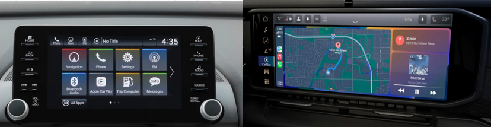

# Digital Cockpits in Vehicles

---

## 1. **In-Vehicle Infotainment (IVI) System**

The infotainment system provides entertainment and information services to passengers and drivers. It manages media playback, navigation, phone calls, and internet-based services. For more details about IVI read those : [IVI_OverView](https://www.monolithicpower.com/en/learning/mpscholar/automotive-electronics/in-vehicle-infotainment-and-connectivity/overview-of-ivi-systems?srsltid=AfmBOoqcA-R_-tGFp-1BK_qEYQsMEKRS1kpgFyUXWkvVGroRTv63G9mV) and [detailedArticle](https://www.einfochips.com/blog/everything-you-need-to-know-about-in-vehicle-infotainment-system/) .

### 1.1. Features:
- **Multimedia Playback:** Supports audio, video, and streaming services.
- **Smartphone Integration:** Compatible with Apple CarPlay and Android Auto.
- **Navigation and Traffic Updates:** Provides real-time navigation data.
- **App Support:** Offers third-party applications like Spotify and YouTube.

### 1.2. Benefits:
- **Enhanced User Experience: **Seamless entertainment and connectivity

  >**What it means:** The IVI system combines entertainment (like Mp3, videos, and games) with connectivity (like internet access, smartphone integration, and real-time information updates) into one easy-to-use platform.
  >
  >**How it works:** Features like Bluetooth pairing, Apple CarPlay, and Android Auto allow users to sync their phones with the system. High-speed internet enables smooth streaming of content, and intuitive user interfaces ensure that drivers and passengers can access these features effortlessly.
  >
  >**Example:** Imagine streaming your favorite playlist from Spotify while the system provides real-time traffic updates, all from the same screen.

- **Safety:** Hands-free control reduces driver distraction

  >**What it means:** Drivers can interact with the system without taking their hands off the wheel or eyes off the road, minimizing distractions.
  >
  >**How it works:** Technologies like voice recognition, steering wheel-mounted controls, and touchless gestures allow users to control the system. For example, a driver can make a call or adjust the volume using voice commands instead of manually interacting with the system.
  >
  >**Example:** Instead of looking at your phone to answer a call, you can simply say, “Answer call,” and the system does it for you.

- **Revenue Opportunities:** Enables subscriptions and app purchases

  >**What it means:** Automakers and third-party developers can generate income through services and features available in the IVI system.
  >
  >**How it works:** Many IVI systems offer paid subscriptions for advanced features like premium navigation, ad-free streaming, or over-the-air updates. They also support app stores where users can purchase apps or games.
  >
  >**Example:** A car owner might pay a monthly fee for real-time traffic updates or purchase a weather app directly from the IVI system.

- **Cloud Connectivity:** Keeps the system updated with the latest features

  >- **What it means:** The system can download updates directly from the internet, ensuring it always has the latest features and fixes.
  >- **How it works:** The IVI system is connected to the cloud, allowing automakers to push software updates remotely. This ensures the system remains secure, functional, and up-to-date without needing to visit a service center.
  >- **Example:** Your car’s IVI system might receive a new user interface design or add support for a new streaming service via an overnight update.

---

## 2. **Digital Cluster**

The digital cluster is a driver-focused display that replaces traditional analog gauges (speedometer, tachometer) with digital screens. It presents critical driving information in real-time.

###  Features:
- **High Customization:** Adjustable themes and layouts to suit driver preferences.

- **Critical Data Display:** Shows speed, RPM, fuel levels, tire pressure, and navigation data.

- **ADAS Integration:** Displays lane assist, collision warnings, and other safety alerts.

  >**Lane Assist:**
  >
  >- If you’re accidentally drifting out of your lane, the cluster shows a warning (like a yellow or red lane indicator) and sometimes vibrates the steering wheel.
  >
  >  .jpg)
  >
  >**Collision Warnings:**
  >
  >- If the car in front of you suddenly slows down, the system shows a visual warning on the cluster (like a red car icon) and may also sound an alert to warn you to brake.
  >
  >  
  >
  >**Other Safety Alerts:**
  >
  >- Alerts for things like blind spots, pedestrians crossing, or if you're too close to another car.
  >
  >  
  >
  >

### Benefits:
- **Safety:** Real-time warnings and clear visibility of critical data.
- **Customization:** Personalizable displays enhance usability.
- **Integration with Vehicle Systems:** Works seamlessly with other vehicle components like ADAS.

---

## 3. **Digital Cockpit**

### Definition:
The digital cockpit is the overarching system that integrates all digital interfaces within the car, including the instrument cluster, infotainment system, and head-up displays. It provides a unified experience for both drivers and passengers.

###  Features:
- **Unified Integration:** Combines IVI, cluster, and other systems into a seamless interface.
- **Cloud Connectivity:** Provides over-the-air updates and smart car features.
- **Advanced Controls:** Features voice and gesture control capabilities.
- **ADAS Integration:** Works closely with driver-assist technologies.

### Benefits:
- **Seamless Interaction:** Unified control of all in-car digital systems.
- **Luxury Appeal:** Aesthetic digital interfaces enhance vehicle value.
- **Enhanced Safety:** Provides centralized access to safety and navigation data.
- **Future-Ready:** Adaptable to emerging technologies like autonomous driving.

---

## 

| Feature               | IVI System                      | Digital Cluster                | Digital Cockpit                    |
| --------------------- | ------------------------------- | ------------------------------ | ---------------------------------- |
| **Scope**             | Entertainment and connectivity. | Driver’s critical information. | Unified interface for all systems. |
| **Primary User**      | Passengers and drivers.         | Driver.                        | Drivers and passengers.            |
| **Key Functionality** | Media, navigation, apps.        | Speed, warnings, ADAS data.    | Centralized integration.           |
| **Customization**     | High, for apps and themes.      | Moderate, for driver themes.   | High, across all systems.          |
| **Connectivity**      | Cloud updates and apps.         | Limited to driving data.       | Cloud, ADAS, and IoT integration.  |

---

## Why Use These Systems in Cars?

1. **Seamless Integration:** Modern vehicles require interconnected systems for smooth operation.
2. **Enhanced Safety:** Advanced displays reduce driver distraction and improve situational awareness.
3. **User Experience:** Offers personalization and accessibility for drivers and passengers.
4. **Technology Adoption:** Prepares vehicles for autonomous and electric vehicle trends.
5. **Revenue Opportunities:** Enables monetization through subscriptions, app sales, and services.
