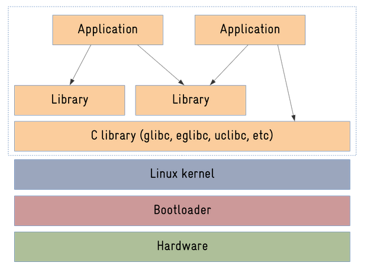
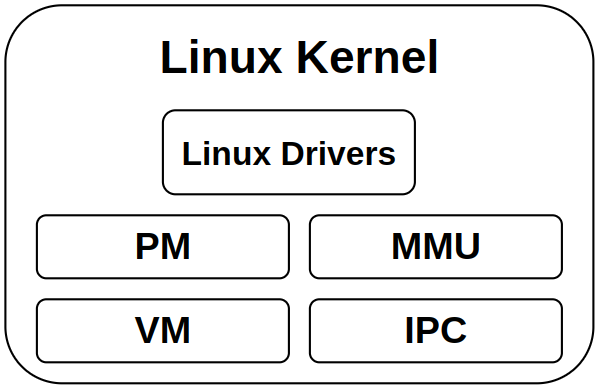
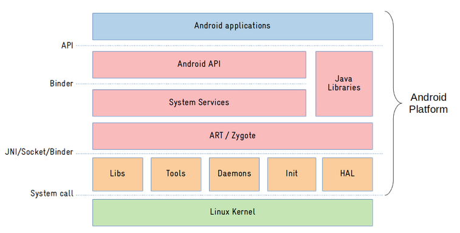
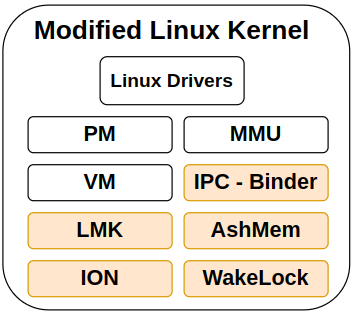

## Linux VS Android

### 1.1. **Kernel Differences:**

- **Linux Kernel:** The standard Linux kernel is a monolithic kernel that is used in a wide variety of systems, including servers, desktops, and embedded devices. It is highly versatile and configurable, but not specifically optimized for mobile devices.

- **Android Kernel:** Android uses the Linux kernel as its foundation but has been modified and optimized for mobile and touchscreen devices. The changes made to the Linux kernel focus on power efficiency, real-time task management, and handling specific hardware components in mobile devices.

| Feature                | Linux Kernel                                                 | Android Kernel                                               |
| ---------------------- | ------------------------------------------------------------ | ------------------------------------------------------------ |
| **Kernel Type**        | [Monolithic kernel](https://www.geeksforgeeks.org/monolithic-kernel-and-key-differences-from-microkernel/) | Modified Linux kernel                                        |
| **Optimization Focus** | General-purpose computing (servers, desktops)                | Optimized for mobile and touchscreen devices                 |
| **Power Management**   | Basic power management                                       | Advanced power-saving features, deep sleep                   |
| **Real-Time Support**  | Optional (via PREEMPT-RT patches)                            | Built-in real-time task management                           |
| **Hardware Support**   | Generic drivers for a wide range of devices                  | Specific drivers for mobile hardware (touchscreen, sensors, camera) |
| **Scheduler**          | General-purpose scheduler                                    | Modified scheduler optimized for mobile use                  |
| **IPC System**         | System V IPC (generic)                                       | Binder IPC (optimized for mobile)                            |
| **Security**           | Basic security features                                      | SELinux, additional cryptographic modules                    |

### 1.2. **C Libraries:**

- **Linux:** Linux uses **glibc**, the GNU C library, which is designed to be a highly flexible and feature-rich library.
- **Android:** Android uses a custom C library called **Bionic**. Bionic is optimized to be lighter and faster, which is crucial for the resource-constrained environments of mobile devices.

### 1.3. **Scheduler Differences:**

- **Linux Scheduler:** Linux uses the Completely Fair Scheduler (CFS), which provides fair scheduling of tasks but does not focus on real-time requirements.

  - #### **Example:**

    - **Task A:** A long-running program like a video rendering software that performs CPU-heavy computations.
    - **Task B:** A terminal that waits for user input and executes commands (interactive).

    Even if **Task B** is waiting for user input, CFS will give both tasks fair CPU time based on their waiting time. If **Task A** has been running longer, it will keep consuming the CPU, and **Task B** will have to wait its turn, causing some delay. While the system as a whole remains fair, **Task B** may experience noticeable lag because the scheduler doesn’t prioritize responsiveness.

- **Android Scheduler:** While Android uses the same Linux scheduler, it has been tuned for mobile devices, prioritizing responsiveness over fairness in some cases. Android also uses a low-latency mode for real-time interaction.

  - - #### **Example:**

      - **Task A:** A background service performing a network sync in the background.
      - **Task B:** A UI thread waiting for a user touch event to respond instantly.

      In this case, **Task B** (the UI thread) needs to respond to user interactions with minimal delay, so Android will prioritize **Task B** over **Task A** even if **Task A** has been running longer. The scheduler will give **Task B** more CPU time to ensure the UI remains responsive, and **Task A** may be temporarily paused or given lower priority. Additionally, Android’s low-latency mode may be used to ensure quick and smooth handling of real-time interactions like touch events or audio processing, where any delay would be noticeable to the user.

### 1.1.4.**Linux IPC Mechanisms:**

In a **Linux system**, traditional IPC mechanisms are used to facilitate communication between processes. These mechanisms have been around for decades and are designed for general-purpose systems. Linux provides several options for IPC:

1. **System V IPC**:
   This is one of the older IPC mechanisms that includes:

   - **Message Queues**: Allow processes to send and receive messages.

     >Allows one process to send messages to another in a queued manner, using a unique identifier (key). The messages remain queued until they are retrieved.

   - **Semaphores**: Used for synchronization between processes to control access to shared resources.

   - **Shared Memory**: A region of memory that can be mapped into the address space of multiple processes, allowing them to share data directly.

   - **Pipes**: A unidirectional communication channel between processes, typically used for simple data flow.

2. **POSIX IPC**:
   This is a more modern version of IPC that conforms to POSIX (Portable Operating System Interface) standards:

   - **POSIX Message Queues**: A more robust and flexible alternative to System V message queues.

   - **POSIX Shared Memory**: Allows multiple processes to share a region of memory in a POSIX-compliant way.
   - **Semaphores and Mutexes**: For process synchronization.

3. **Sockets**:
   A widely-used IPC method that enables communication between processes over networks or within the same system (local communication through Unix domain sockets).

**Example of Linux IPC:**Imagine two processes:

- **Process A** that writes data to a shared memory segment.
- **Process B** that reads the data from the shared memory segment.

With **POSIX Shared Memory**, both processes can access the same memory region directly, without needing to go through the kernel for each communication. This allows fast, direct data transfer, but the programmer needs to handle synchronization to ensure that no data corruption occurs (e.g., using semaphores).

----------------------------

### Android IPC - Binder:

On **Android**, traditional IPC mechanisms are not used. Instead, Android uses a custom-designed **Binder IPC** system, which is more optimized for the mobile environment. Binder is tailored to meet the specific needs of mobile devices, such as low power consumption, security, efficiency, and interaction between apps and system services.

#### **Binder IPC Overview:**

- **Binder** is a high-performance, object-oriented IPC mechanism that enables communication between processes on the same device or between different devices.
- It uses a **client-server** model, where one process acts as a client (requesting services) and another process acts as a server (providing services).
- It is designed to be lightweight, fast, and secure, making it ideal for mobile systems with limited resources.

In Android, **Binder** facilitates communication between:

- **Apps**: Apps can interact with each other and access system-level services.
- **Apps and System Services**: Android’s system services (like the Camera, Location, or Audio Services) communicate with apps using Binder.

### 1.5. **Hardware Abstraction Layer (HAL):**

- **Linux:** In standard Linux, hardware access is usually done directly via drivers.
- **Android:** Android has a **Hardware Abstraction Layer (HAL)**, which abstracts the underlying hardware from the Android framework. This allows developers to write apps without worrying about the hardware specifics, making the system more flexible and scalable across different devices.

### 1.6. **Memory Management:**

- **Linux:** Linux handles memory management via traditional mechanisms like **Virtual Memory** and **OOM (Out of Memory) Killer**.
- **Android:** Android adds the **Low Memory Killer**, which kills background apps when memory is low to ensure foreground tasks continue running smoothly, tailored to mobile device resource constraints.

### 1.7. **User Interface and Target Audience:**

- **Linux:** Linux is used in a broad spectrum of environments, from servers to desktops, and even embedded systems. It provides a traditional command-line interface (CLI), but also supports graphical interfaces with desktop environments like GNOME, KDE, etc.
- **Android:** Android is designed specifically for mobile devices with a touch interface. It’s heavily optimized for user interaction on smartphones, tablets, and, more recently, automotive infotainment systems. The interface is highly graphical, offering rich apps with gestures and touch support.

### 1.8. **Target Use Cases:**

- **Linux:** Linux is used in personal computers, servers, mainframes, embedded systems, and supercomputers. It's highly versatile, and its core design focuses on stability, security, and multitasking.
- **Android:** Android, on the other hand, is used primarily for mobile devices, with a focus on power efficiency, resource management, and ease of use. Android is heavily optimized for touch-based interactions and running apps that are downloaded from app stores.

### 1.9. **Security:**

- **Linux:** Linux has a strong security model based on traditional UNIX permissions and security modules like SELinux. However, its security can be complex to configure and is mostly set up by system administrators.
- **Android:** Android builds on Linux's security, but it has its own set of features, like **app sandboxing** (isolating apps from one another), and **Google Play Protect**, which helps keep devices secure by scanning apps for malicious activity. It also uses **cryptographic features** to protect sensitive data and ensure app integrity.

#### --------------------------------------------------------------------------------------------

#### Why Use Android in Automotive Instead of Linux?

1. **Touch Interface and User Experience:** Android provides an intuitive user interface designed for touch interactions, which is ideal for automotive infotainment systems. It integrates well with modern touchscreens, offering a rich experience with apps, voice recognition, and gestures.

2. **App Ecosystem:** Android has access to a vast repository of applications from the **Google Play Store**, which makes it easier to build and integrate third-party applications for automotive infotainment systems, including navigation, media streaming, and productivity apps.

3. **Familiarity and Development Tools:** Android provides an established framework for developers, with robust development tools (like Android Studio) and APIs that are familiar to a large pool of developers. This helps accelerate development and reduces the learning curve compared to working with Linux directly.

4. **Google Services Integration:** Android integrates seamlessly with Google services such as **Google Maps**, **Google Assistant**, **Google Play Music**, and more, which are often desired features in modern infotainment systems.

5. **Real-Time Optimizations:** While Android doesn't support real-time computing natively, it provides a better experience for infotainment systems by optimizing task prioritization, memory management, and multitasking, ensuring a smooth user experience for the average consumer.

6. **Automotive-Specific Customizations:** Google has developed **Android Automotive OS**, a version of Android specifically tailored for the automotive industry. It supports deeper integration with vehicle hardware, sensors, and controls, enabling car manufacturers to customize the system to meet their specific needs.

   ### 

####  Differences Between Logging Systems

| Feature                      | Linux                                 | Android                                     |
| ---------------------------- | ------------------------------------- | ------------------------------------------- |
| **Kernel Logs**              | `dmesg`                               | `dmesg`                                     |
| **Service/Application Logs** | `journalctl` (for systemd services)   | `logcat` (for apps and Android services)    |
| **Purpose**                  | General-purpose OS and server logging | Focused on embedded/mobile use cases        |
| **Log Storage**              | Persistent with `systemd` journal     | Circular buffers for performance efficiency |
| **Filtering and Tagging**    | Filters via `journalctl` options      | Tags and priorities in `logcat`             |

#### ----------------------------------------------------------------------------------------------

### 1.11. Linux Vs AOSP Architecture

#### 1.11.1. Linux Architecture

#### 1. **Hardware**:

- This is the physical layer consisting of the actual device's electronic components (e.g., CPU, RAM, storage, I/O interfaces, and peripherals).
- The hardware layer interacts directly with the **bootloader** and **Linux kernel**, which configure and control the hardware resources.

#### 2. **Bootloader**:

- The bootloader is the first software that runs after the device is powered on.
- Functions :
  - Initializes the hardware components (e.g., memory, CPU clocks, and peripherals).
  - Loads the Linux kernel into memory.
  - Passes control to the kernel to start the operating system.
- Examples of bootloaders:
  - **U-Boot**: Common in embedded systems.
  - **GRUB**: Used in some Linux distributions.
  - **Barebox**: Another alternative for embedded devices.

#### 3. **Linux Kernel**:

- The kernel is the core of the operating system, managing communication between the hardware and software.

- Responsibilities :

  - **Device Drivers**: Enable interaction with hardware components (e.g., USB, storage, network interfaces).
  - **Process Management**: 

    - Handles process scheduling, creation, termination, and synchronization.
    - Manages system resources like CPU time and memory.
    - Includes support for multitasking and thread management.
  - **File System Management**: 

    - Provides interfaces to interact with various file systems.

    - Examples of supported file systems: EXT4, FAT, NTFS, Btrfs, XFS.

    - Includes Virtual File System (VFS) for abstracting file system operations.

  - **Networking**: Manages network protocols and connections.

  - **IPC (Inter-Process Communication)**: Allows processes to communicate and share data.

  - **PM (Power Management)**: Manages energy consumption, which is crucial for mobile devices.

  - **VM (Virtual Memory)**: Provides memory visualization for efficient use of hardware memory.

    >>**Virtual Memory** is a system that gives each process (running program) its own "virtual" view of memory, even if the actual physical memory (RAM) is limited or shared with other processes.
    >>
    >>- **Why is it used?**
    >>  - **Isolation:** Each process works in its own isolated memory space. One process cannot directly access or corrupt another process's memory.
    >>  - **Efficiency:** If physical memory is insufficient, the kernel can temporarily move data to the hard disk (using a "swap space").
    >>  - **Convenience:** The process thinks it has access to a large, continuous block of memory, even though it's scattered across different parts of RAM or disk.
    >>- **How does it work?**
    >>  - Instead of directly accessing physical memory, processes access **virtual addresses**.
    >>  - The kernel maps these virtual addresses to actual **physical memory addresses**.
    >>  - Example:
    >>    - Process A thinks it’s accessing memory at address `0x0010`, but this is mapped to physical memory at `0xABC0`.
    >>    - Process B could also think it’s accessing memory at `0x0010`, but it’s mapped to a completely different physical address.

- **MMU (Memory Management Unit)**: Handles memory management for efficient allocation.

  >- The MMU is a hardware component (built into the CPU) that translates **virtual memory addresses** to **physical memory addresses**.
  >
  >**Why is it important?**
  >
  >- It enables the virtual memory system to work by performing the translation automatically and quickly.
  >
  >**How does it work?**
  >
  >- When a process accesses a virtual address, the MMU:
  >  1. Looks up the **page table** (managed by the kernel).
  >  2. Translates the virtual address into the corresponding physical address.
  >  3. Sends the physical address to the CPU to perform the memory operation.
  
  
  
- The Linux kernel is modular and can be customized for specific embedded applications by including only the necessary drivers and features.

  ---------------

#### 4. **System Calls Interface**:

- Acts as the bridge between the kernel space (drivers and Linux OS) and user space (libraries and applications).

- Provides standardized mechanisms for user applications to request services (e.g., file handling, process management, or networking) from the kernel.

  ---------------

#### 5. **C Library**:

- The C library provides the basic functionality needed for applications to communicate with the kernel.

- **Role:**

  - Acts as an interface between user-space applications and the kernel.
  - Implements standard system calls (e.g., `open()`, `read()`, `write()`).

- Common C libraries in embedded systems:

  - **glibc**: The GNU C Library, used in most general-purpose Linux distributions.

  - **eglibc**: A lightweight version of glibc, used for embedded systems (deprecated in favor of glibc).

  - **uClibc**: A smaller, more efficient alternative designed for embedded systems.

  - **musl**: A modern, lightweight alternative gaining popularity in embedded Linux.

    -------------------

#### 6. **Libraries**:

- These are collections of reusable code that provide specific functionality, such as graphics, networking, or database management.

- **Purpose:**

  - Allow applications to perform advanced tasks without needing to implement everything from scratch.

- Examples:

  - Graphics libraries like **OpenGL**.

  - Networking libraries like **libcurl**.

  - Embedded database libraries like **SQLite**.

    --------------------------

#### 7. Root Filesystem (Rootfs):

- The **rootfs** includes all the software required to run the system, excluding the kernel.

- Contains:

  - **Binaries**: Executable files for system utilities and applications.

  - **Libraries**: Supporting code for applications and system utilities.

  - **Configuration Files**: For initializing the system and controlling hardware/software behavior.

  - **Data**: Logs, temporary files, or application data.

    -----------------

#### 8. **Applications**:

- These are the user-facing programs that run on the embedded Linux system.

- **Examples:**

  - **In-vehicle infotainment (IVI) system**: An application that provides media, navigation, and communication services to the driver and passengers.
  - **Vehicle diagnostic tool**: A program used to monitor and troubleshoot the performance of various car components (e.g., engine, transmission, sensors).
  - **Advanced driver-assistance system (ADAS)**: Software responsible for features like lane-keeping assistance, automatic emergency braking, or adaptive cruise control.

  Applications interact with automotive libraries, sensors, and kernel (via the C library) to perform their tasks.

------

### 1.11.2. Android Architecture

#### 1.11.2.1. **Modified Linux Kernel **:

- **Base Linux Kernel**: Android uses a modified version of the **Linux kernel**. The kernel itself is similar to the traditional Linux kernel but includes specific changes to support Android features and mobile hardware.

- **Changes** :

  - **Binder**: A custom **Inter-Process Communication (IPC)** mechanism that allows efficient communication between applications and system services. This is Android's primary mechanism for remote procedure calls (RPC), unlike traditional Linux systems that use **DBUS** for IPC.

- **Ashmem**: Android uses a **custom shared memory** allocator called **Ashmem** for inter-process communication, replacing POSIX shared memory. This is designed to be more efficient on mobile devices.

- **Low Memory Killer**: In a mobile environment, memory is limited. Android enhances the **Out-Of-Memory (OOM) killer** in the Linux kernel to provide **Low Memory Killer**, which proactively terminates processes when the system is running low on memory, based on priorities.

  >**Low Memory Killer (LMK) in Android**
  >
  >- **Purpose**: The LMK is specifically designed for resource-constrained devices, like smartphones, where running out of memory is common due to limited physical RAM.
  >- **How it Works:**
  > - Monitors memory usage continuously.
  > - Proactively terminates background apps or processes when memory falls below certain thresholds to free up memory before the system becomes critically low.
  > - It works alongside a user-space daemon (**lmkd**) to decide which processes should be killed, often based on priorities and app states (e.g., background apps are killed before foreground ones).
  >- **Why Android Needs LMK :**
  > - Android devices frequently run multiple apps simultaneously, and switching between apps needs memory.
  > - Killing less important or inactive apps ensures a smooth user experience and prevents crashes due to memory exhaustion.
  >
  >-------------------
  >
  >**Out-Of-Memory (OOM) Killer in Normal Linux**
  >
  >- **Purpose**: The OOM Killer in the Linux kernel is a last-resort mechanism to free up memory when the system **runs out of memory entirely**.
  >- How it Works:
  > - The OOM Killer is only invoked when the system has exhausted all available memory and swap space.
  > - It identifies and kills the "least important" process to free up memory. The selection is based on factors like process memory usage, priority, and how critical it is to the system.
  > - Unlike Android's LMK, the OOM Killer does not proactively monitor or terminate processes; it only activates in emergencies.
  >
  >-----------------------------

- **ION (Input/Output Memory Manager)**

  > **ION** is a memory management system used in Android, primarily designed to handle efficient allocation and management of memory in devices with complex hardware, like smartphones and embedded systems. It allows different components of the system (like the CPU, GPU, and other hardware accelerators) to share memory buffers in an efficient way, improving overall performance and memory usage.

- **Wakelock**

>A **wakelock** is a mechanism in Android that allows an application or the system to prevent the device from entering low-power states, like **sleep** or **doze mode**. Wakelocks are used to ensure that the system remains active when it needs to perform background tasks such as downloading data, playing music, or maintaining network connections.
>
>- **Purpose**: The main purpose of a wakelock is to **keep the device awake** (i.e., not allow the CPU to enter a low-power sleep mode) when an operation that requires continuous processing is running. This ensures the app or service can complete its task without interruption.
>
>  - **Types of Wakelocks**:
>   - **Full Wakelock**: This type of wakelock keeps the CPU running and prevents the device from going into sleep mode. However, the screen might still turn off.
>   - **Partial Wakelock**: This type keeps the CPU awake but allows the screen to turn off to save power.
>   - **Screen Wakelock**: This type keeps the screen on while still allowing the CPU to sleep.
>  - **How Wakelocks Work**:
>   - When an application or system process requires the CPU to stay awake (for example, for a long-running task), it acquires a wakelock.
>   - If a wakelock is not released after the task is finished, it can lead to unnecessary battery consumption because the CPU stays on longer than needed. Thus, it’s important to release the wakelock once the task is completed.
>  - **Types of Wakelock Sources**:
>   - **CPU Wakelocks**: These prevent the CPU from entering sleep modes.
>   - **Display Wakelocks**: These prevent the screen from turning off.
>  - **Wakelock Example**: If an app is downloading a file in the background, it would request a wakelock to ensure that the phone does not go to sleep and interrupt the download. Once the download completes, the app would release the wakelock to allow the phone to return to its normal power-saving states.
>
>  #### Potential issues with Wakelocks:
>
>  - **Battery Drain**: Keeping the CPU and other components awake for too long can lead to significant battery consumption. Mismanagement of wakelocks (not releasing them when no longer needed) is a common cause of battery drain in Android devices.
>  - **Doze Mode**: Android introduced **Doze Mode** in Android 6.0 (Marshmallow) to help conserve battery by restricting network access and deferring background tasks when the device is not being actively used. However, apps that have acquired a wakelock can still prevent the system from entering Doze Mode, which can lead to higher power consumption.
