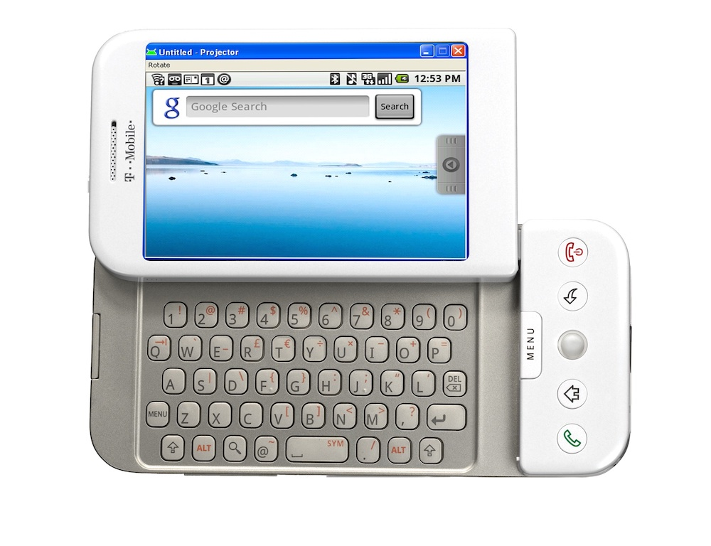
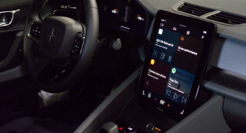
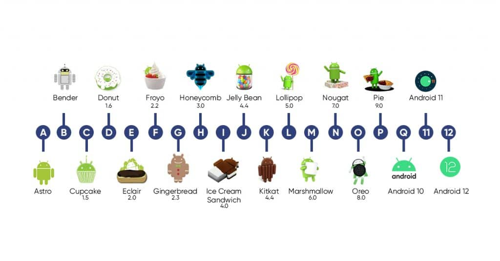

#  Android Operating System

## 1. Android OS

Android is an open-source operating system developed by Google, primarily designed for mobile devices like smartphones and tablets. However, it has expanded to various other platforms, including TVs, wearable devices, and automotive systems. Android’s flexibility, scalability, and customization options make it a popular choice in the embedded systems and automotive industries.

The **Android kernel** is based on the **Linux kernel**. The Android operating system leverages the Linux kernel as its core component, handling the low-level tasks such as **hardware abstraction**, **process management**, **memory management**, **device drivers**, and **networking**. While Android uses the Linux kernel, the rest of the Android OS—such as the application framework, libraries, and runtime—is designed specifically for mobile devices, providing a rich set of APIs and tools for app development.

## 2. Android History

### 2.1. **Early History and Development**

- **2002**: Google co-founders Larry Page and Sergey Brin were inspired by Andy Rubin's **Sidekick phone**.

  

- **2003**: Andy Rubin established **Android Inc.** with the goal of creating an open-source mobile OS.

- **2005**: Google acquired **Android Inc.**

- **2007**: The **Android platform** was publicly launched via the **Open Handset Alliance**.

- **2008**: The first Android version launched with the **HTC Dream (T-Mobile G1)**, gaining rapid adoption due to its open-source nature.

  

------

### 2.1.1. **Android’s Growth and Expansion**

- **Rapid Evolution (2008–2013)**:

  - Significant updates like **Cupcake**, **Donut**, and **Froyo** introduced multi-touch support, better user interfaces, and faster processing.
  - Android became the dominant mobile OS with a strong developer community.

- **Adoption in New Devices (2011–2014)**:

  

  - **Tablets**: Introduced with **Honeycomb** (2011).
  - **TVs**: Android TV launched in 2014.
  - **Wearables**: Wear OS launched in 2014, creating a versatile Android ecosystem.

------

### 2.1.2. **Android Enters the Automotive Space**

- **Android Auto (2014)**:
  - Platform launched to connect Android smartphones to car infotainment systems.
  - Allows access to **Google Maps**, **Google Assistant**, and third-party apps for navigation, music, and communication.
- **Android Automotive OS (AAOS) (2017)**:
  - Introduced as a standalone OS embedded directly into vehicles, eliminating the need for a smartphone.
  - **Volvo** was the first to implement AAOS in 2019 for:
    - Infotainment systems.
    - Climate control.
    - Navigation.
    - Advanced vehicle features.
- **Partnerships and Growth (2018–Present)**:
  - Major manufacturers like **GM**, **Ford**, **Stellantis**, and **Renault-Nissan-Mitsubishi** partnered with Google to integrate AAOS.
  - AAOS continues to evolve with:
    - Support for third-party apps.
    - Integration of **Google services**.
    - Deeper integration into vehicle systems.

------------------------------------------------------------------

### Android Releases

**Android 1.0**

- Release Date: September 23, 2008
- Codename: None

**Android 1.1**

- Release Date: February 9, 2009
- Codename: Petit Four

**Android 1.5**

- Release Date: April 27, 2009
- Codename: Cupcake

**Android 1.6**

- Release Date: September 15, 2009
- Codename: Donut

**Android 2.0 - 2.1**

- Release Date: October 26, 2009
- Codename: Eclair

**Android 2.2 - 2.2.3**

- Release Date: May 20, 2010
- Codename: Froyo

**Android 2.3 - 2.3.7**

- Release Date: December 6, 2010
- Codename: Gingerbread

**Android 3.0 - 3.2.6**

- Release Date: February 22, 2011
- Codename: Honeycomb

**Android 4.0 - 4.0.4**

- Release Date: October 18, 2011
- Codename: Ice Cream Sandwich

**Android 4.1 - 4.3.1**

- Release Date: July 9, 2012
- Codename: Jelly Bean

**Android 4.4 - 4.4.4**

- Release Date: October 31, 2013
- Codename: KitKat

**Android 5.0 - 5.1.1**

- Release Date: November 12, 2014
- Codename: Lollipop

**Android 6.0 - 6.0.1**

- Release Date: October 5, 2015
- Codename: Marshmallow

**Android 7.0 - 7.1.2**

- Release Date: August 22, 2016
- Codename: Nougat

**Android 8.0 - 8.1**

- Release Date: August 21, 2017
- Codename: Oreo

**Android 9.0**

- Release Date: August 6, 2018
- Codename: Pie

**Android 10**

- Release Date: September 3, 2019
- Codename: None (transitioned to version numbers)

**Android 11**

- Release Date: September 8, 2020

**Android 12**

- Release Date: October 4, 2021

**Android 13**

- Release Date: August 15, 2022

**Android 14**

- Release Date: October 4, 2023

**Android 15**

- Release Date: October 15, 2024