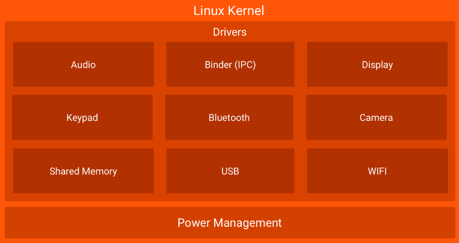
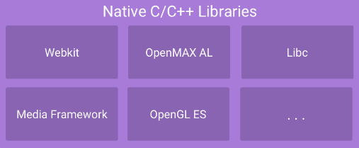
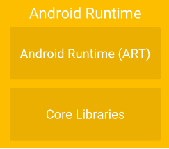
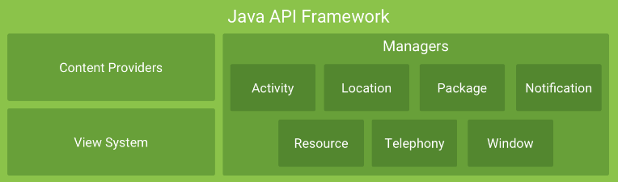

## Android Open Source Project AOSP 

The **Android Open Source Project (AOSP)** is the initiative led by Google to maintain and develop Android as an open-source platform. AOSP provides the source code for Android, which is the operating system used by a wide range of mobile devices such as smartphones, tablets, and even other hardware platforms. It includes the core components such as the Linux kernel, libraries, runtime, and application framework, along with essential system apps (e.g., contacts, messaging, and phone apps).

AOSP allows anyone to access, modify, and distribute the Android operating system. This openness encourages customization and innovation, and many device manufacturers, such as Samsung, Xiaomi, and others, build on AOSP to develop their own custom Android versions (with additional features and skins).

### 1. Android Platform Architecture

In the architecture of the Android platform. Each layer has specific purposes and components, contributing to Android's ability to run efficiently on devices like smartphones, tablets, Android TV, and **Android Automotive OS (AAOS)**. Let’s break down the **layers, their features, and their roles** in general Android usage and Android Automotive.


#### 1.1. Linux Kernel Layer 

The **Linux kernel** is the core component of the Android operating system. It acts as the bridge between the hardware and the software, providing essential functionalities such as device drivers, memory management, process management, and security. Android is built on top of the Linux kernel, leveraging its stability, security, and scalability. The Linux kernel handles various hardware interactions, allowing Android to support a wide range of devices. It also provides the foundation for Android's multi-tasking capabilities, power management, and resource allocation.



- **Purpose**: At the core, Android uses the **Linux Kernel** to manage hardware abstraction, device drivers, and resource management.

**Why Use Linux Kernel in Android?**

The choice of the **Linux Kernel** for Android is driven by several compelling reasons:

1. **Great Memory and Process Management:**
   - The Linux Kernel has robust memory management capabilities, which is crucial for handling the limited resources (e.g., RAM) in mobile devices. It uses techniques like **virtual memory**, **page swapping**, and **memory overcommit handling** to ensure efficient allocation and deallocation of memory across running processes.
2. **Permission-Based Security Model:**
   - Linux provides a permission-based security model where each process and file has a specific owner and set of access permissions. This helps in controlling access to system resources and enhances security. In Android, this model is extended to apps running in a **sandbox** to ensure they can't access each other's data without permission.
3. **Support for Shared Libraries:**
   - Linux supports **shared libraries**, which allows multiple programs to share common code, reducing memory usage and making applications more efficient. Android leverages this to reduce the size of apps and ensure faster execution.
4. **Open Source:**
   - Linux is open-source software, meaning its code can be freely modified and distributed. This is beneficial for Android development, as it allows manufacturers to customize the kernel for their hardware and optimize it for their devices.

### **Kernel Enhancements in Android:**

The **Android Kernel** has undergone several enhancements to meet the specific needs of mobile devices and improve the performance of Android apps. Some key kernel modifications and drivers include:

1. **Alarm Driver:**

   - Android introduced an **alarm driver** to allow scheduled tasks and wake-up events. This driver enables devices to wake up from a sleep or low-power state at scheduled times, thus supporting tasks like alarms, notifications, and periodic background updates even when the device is in deep sleep.

2. **ASHMEM (Android Shared Memory):**

   - **ASHMEM** is a memory management technique in Android where multiple processes or apps can share memory regions. This allows efficient data sharing between apps without the need for copying large amounts of data, improving performance.

3. **Binder:**

   - **Binder** is the **inter-process communication (IPC)** mechanism in Android. It facilitates communication between apps and system services. Binder uses **shared memory** to improve performance and allows processes to communicate with each other using synchronous calls, making it a high-performance IPC system. Android apps and services communicate with each other via Binder to share data, request services, and perform other tasks.

4. **Low Memory Killer (LMK):**

   - The **Low Memory Killer** is a kernel feature that helps manage memory on devices with limited resources. When the system detects low memory, the LMK automatically terminates background processes to free up memory and ensure that active apps or services continue running smoothly. This helps prevent the system from crashing due to memory exhaustion.

5. **Kernel Debugger:**

   - Android also incorporates a kernel debugger for easier debugging of kernel-level code. This is particularly useful for identifying and fixing issues related to hardware drivers, system performance, and low-level system crashes. KGDB (Kernel GNU Debugger) and **Android Debug Bridge)** `adb`

6. **Power Management Driver:**

   - **Power management** is one of the most important aspects of mobile devices, given the limited battery capacity. Android has enhanced the Linux power management system to support **wakelocks**. Wakelocks keep the device awake for specific tasks (like music playback or data syncing), and Android uses **partial wakelocks** (keeping some parts of the device awake) and **full wakelocks** (keeping the entire device awake) to minimize power consumption.
   - Android's **wakelock system** helps manage power by allowing background tasks to run while preventing the device from staying awake unnecessarily.

7. **Logger:** Logcat

   - Android's kernel includes a **logging system** that helps in debugging and monitoring system behavior. It allows for logging system messages (such as errors, warnings, and debugging info) that can be collected and analyzed by developers or device manufacturers. This is useful for diagnosing issues with the device and ensuring that everything is working as expected.

   -------------------------------------------------------------------

- **Role in Android Automotive**:

  - Enables hardware integration with the vehicle’s sensors, cameras, audio, and displays.
  - For example, drivers for vehicle **sensors** (like temperature and accelerometer) or **infotainment controls** depend on this kernel layer.
  - Power management is critical for cars, ensuring battery efficiency when running vehicle electronics.

- **Example**:

  - When a user streams music via **Spotify** in the infotainment system, the kernel handles communication between the media app and the **audio driver**.
  - For a camera view displayed while reversing, the **camera driver** relays data efficiently.

  ---------------------------

### 1.2. Hardware Abstraction Layer HAL

The Hardware Abstraction Layer (HAL) provides a standard interface between the Android OS and the device’s hardware. HAL is crucial for Android’s flexibility across various devices with different hardware configurations.


- **Standard Interfaces**: HAL defines a set of functions that expose hardware capabilities to the Android system. For instance, there are HAL modules for camera, audio, sensors, and more.
- **Hardware Flexibility**: By abstracting the hardware specifics, HAL allows Android to run on a wide variety of devices without requiring changes to the upper layers of the architecture.

**Example**: If a device manufacturer  or OEM adds a new type of sensor, they can create a HAL module for it. The Android system can then interact with the sensor without needing any changes to the app’s code.

- **Purpose**: HAL abstracts hardware components so they can interact with higher-level software components without needing driver-level code changes.
- **Features**:
  - Provides **interfaces** for hardware components like **Audio**, **Bluetooth**, **Camera**, and **Sensors**.
  - Ensures that **device-specific implementations** remain isolated and modular.
- **Role in Android Automotive**:
  - HAL facilitates communication between vehicle hardware and the **Android Runtime** or applications.
  - For instance, the **Bluetooth HAL** ensures seamless connection between the vehicle infotainment system and a smartphone for hands-free calling or media playback.
- **Example**:
  - If the vehicle integrates **sensors** for monitoring **tire pressure** or **fuel efficiency**, the HAL layer ensures this data is passed up to higher-level applications for display or analysis.

### **1.3. Native C/C++ Libraries**

**Android platform/native libraries** are a collection of pre-compiled code modules that provide essential functions and services to Android applications. These libraries include various components such as graphics rendering, multimedia processing, network communication, database management, and more. They are written in C/C++ and are accessible to developers through the Android Native Development Kit (NDK). By leveraging these libraries, developers can enhance the functionality and performance of their apps, as well as access low-level system resources. The platform/native libraries serve as a foundation for building powerful and feature-rich Android applications.



>**Android Native Development Kit (NDK)**
>
>The Android NDK is a toolset that lets you implement parts of your Android App in native code, using languages such as C and C++. For certain types of apps, this can help you reuse code libraries written in those languages. By using the NDK, developers can:
>
>1. **Access Low-Level System APIs**: Directly interact with device hardware, sensors, and other native components.
>2. **Leverage Performance**: Write performance-critical code in C/C++ to optimize for tasks such as game engines, multimedia processing, or heavy computation.
>3. **Reuse Existing Code**: Integrate libraries or code written in C/C++ from other platforms into Android applications.
>
>**How the NDK Works**
>
>1. **Code in C/C++:** Developers write native code for specific tasks.
>2. **JNI (Java Native Interface) :** A bridge between Java/Kotlin and native code. It allows the Android runtime to interact with the native C/C++ code.
>3. **Compilation:** The NDK compiles the C/C++ code into a shared library (`.so` file).
>4. **Integration:** The shared library is bundled with the Android app (APK) and called from Java/Kotlin code as needed.
>
>------------

>#### **Scenario:**
>
>You are building an **Android Automotive Infotainment System** application that needs to handle real-time data processing for vehicle sensors (e.g., speed, RPM, and temperature) and display the results on a **digital dashboard**. To ensure low latency and high performance, you decide to use the **Android NDK** for processing sensor data.
>
>1. Use native C++ code to:
>   - Read and process real-time vehicle sensor data.
>   - Perform computations for metrics like average speed or fuel efficiency.
>   - Optimize performance for continuous, high-speed data input.
>2. Use JNI to pass the processed data to the Java/Kotlin layer for visualization on the Android Automotive UI.
>
>------
>
>

- **Native C/C++ Libraries Purpose**: Provide core functionalities and optimized performance for Android applications.

- **Native C/C++ Libraries Features**:

  - Includes libraries like **OpenGL ES** for graphics, **WebKit** for web browsing, **Media Framework** for audio/video playback, and **Libc** for system operations.

    >#### 1. OpenGL
    >
    >**OpenGL** stands for **Open Graphics Library**.
    >
    >It is a cross-platform, industry-standard API used for rendering 2D and 3D graphics.Originally developed for desktop systems, OpenGL allows developers to communicate with the **GPU (Graphics Processing Unit)** to accelerate graphics rendering, making applications faster and visually richer.
    >
    >- **OpenGL ES** (OpenGL for Embedded Systems) is a lightweight version of OpenGL, specifically designed for resource-constrained devices like: **Smartphones**, **Tablets**, **Video game consoles** , **Personal Digital Assistants (PDAs)**, and **Digital cockpits in Vehicles** 
    >- It enables hardware-accelerated rendering of 2D and 3D graphics on these devices.
    >
    >**Why OpenGL ES?**
    >
    >Embedded devices often have limited: **Processing Power**, **Memory** and **Battery Life**
    >
    >OpenGL ES addresses these constraints by:
    >
    >- Removing less-used features of OpenGL.
    >- Focusing on performance optimization for embedded hardware.
    >- Ensuring compatibility across a variety of devices with different GPU architectures.
    >
    >**How OpenGL ES is Used in IVI and Digital Cockpits** :
    >
    >**1. High-Quality Rendering**
    >
    >- **Graphics for Dashboards and Clusters:**
    >  - OpenGL ES enables smooth, real-time rendering of graphical components such as:
    >    - Gauges (speedometer, RPM, fuel level).
    >    - Navigation maps with live updates.
    >    - Warning indicators and diagnostics.
    >- **3D Animations:** Creates animations for gear shifts, driving modes, or alerts.
    >
    >**2. Touchscreen Interactivity**
    >
    >- OpenGL ES supports rendering intuitive and responsive UI elements for touchscreens:
    >  - Menus, buttons, and sliders.
    >  - Drag-and-drop interactions for navigation or media controls.
    >- **Example:** Touch-based climate control or seat adjustment in luxury vehicles.
    >
    >**3. Navigation Systems**
    >
    >- OpenGL ES powers real-time 3D maps with:
    >  - Zoom, pan, and rotate functionalities.
    >  - Integration with GPS data for turn-by-turn navigation.
    >  - Rendering terrain, buildings, and landmarks in 3D.
    >
    >**4. Multi-Screen Support**
    >
    >- IVI and Passenger Displays:
    >  - OpenGL ES enables rendering for multiple displays in the car, such as:
    >    - Driver's instrument cluster.
    >    - Central IVI display.
    >    - Rear passenger entertainment screens.
    >- Example: Different content on driver and passenger screens using shared GPU resources.
    >
    >**5. Augmented Reality (AR)**
    >
    >- OpenGL ES integrates with AR features in some vehicles:
    >  - Rendering overlays for heads-up displays (HUD).
    >  - Enhancing the driver’s view with navigation directions projected on the windshield.
    >  - Visualizing nearby vehicles or hazards detected by sensors.
    >
    >**6. Performance Optimization**
    >
    >- Low Power Usage:
    >  - Since vehicles rely on limited resources, OpenGL ES ensures efficient GPU utilization, reducing power consumption and heat generation.
    >- Real-Time Graphics:
    >  - Offers low-latency rendering, essential for real-time updates like speed or collision warnings.
    >
    >**7. Customization and Themes**
    >
    >- OpenGL ES supports customizable skins and themes for IVI and digital cockpit interfaces:
    >  - Day/Night modes with adaptive brightness.
    >  - Themes tailored to different driving modes (e.g., Eco, Sport).
    >
    >--------------------------

    >#### 2. WebKit
    >
    >- **WebKit** is an open-source web browser engine used to render web content such as HTML, CSS, and JavaScript.
    >- It is the engine behind popular browsers like Safari and Chrome (Blink is a fork of WebKit).
    >
    >**Applications in IVI and Digital Cockpits**
    >
    >- Integrated Web Browsers:
    >  - Allows drivers and passengers to access online content directly from the infotainment system.
    >- Web-Based Apps:
    >  - Renders applications like weather, news, or restaurant finders.
    >- Over-The-Air Updates (OTA):
    >  - Provides a UI for updating vehicle software via web-based services.
    >- Cloud Integration:
    >  - Displays live data such as traffic updates, stock market information, or calendar events.
    >
    >**Benefits**
    >
    >- Supports modern **web standards** (HTML5, CSS3, JavaScript).
    >- Lightweight and optimized for **embedded systems**.
    >- Ensures **fast rendering** and a smooth browsing experience.
    >
    >------------------------

    ****

    >#### 3. Media Framework for Audio/Video Playback
    >
    >- A **Media Framework** is a collection of APIs and libraries for processing and rendering audio and video content.
    >- Examples: **GStreamer, FFmpeg, Android Media Framework.**
    >
    >**Applications in IVI and Digital Cockpits**
    >
    >- Audio Playback:
    >  - Plays music, podcasts, or audiobooks from local storage or streaming services.
    >  - Integrates with voice assistants for seamless control.
    >- Video Playback:
    >  - Powers rear-seat entertainment screens or displays promotional videos.
    >- Phone Integration:
    >  - Provides hands-free calling and text-to-speech capabilities.
    >- Surround Sound:
    >  - Offers immersive audio experiences using vehicle-specific speaker configurations.
    >
    >**Benefits**
    >
    >- **Hardware-accelerated decoding** for smooth playback.
    >- Support for multiple formats (MP3, AAC, H.264, etc.).
    >- Low latency for real-time audio and video synchronization.
    >
    >------------------------------------

    >**4. OpenMAX AL**
    >
    >**OpenMAX AL** (Application Layer) is a cross-platform multimedia API specification developed by **Khronos Group**. It is designed to provide a standardized way for applications to access **audio, video, and image processing** functionalities on different hardware platforms.
    >
    >The **OpenMAX AL** specification enables efficient multimedia processing by abstracting the low-level hardware details, allowing developers to write portable code across multiple platforms, including embedded systems like **Android Automotive**.
    >
    >**Features of OpenMAX AL**
    >
    >>1. Cross-Platform Compatibility:
    >>   - Works across various hardware and operating systems, ensuring portability.
    >>2. High-Performance Multimedia:
    >>   - Optimized for multimedia playback, recording, and processing (e.g., audio/video streams).
    >>3. Abstraction Layer:
    >>   - Provides an interface between applications and low-level multimedia components.
    >>4. Modular and Scalable:
    >>   - Supports modular architecture, making it scalable for applications requiring complex media operations.
    >>
    >>**Usage in Android Automotive**
    >>
    >>In Android Automotive systems, **OpenMAX AL** is used to facilitate high-performance multimedia tasks, such as:
    >>
    >>- **Audio Playback**: Playing music from the car's infotainment system.
    >>- **Video Playback**: Rendering videos for rear-seat entertainment systems.
    >>- **Voice Command Processing**: Handling audio input for voice recognition features.
    >>- **Camera and Media Recording**: Capturing video streams for advanced driver-assistance systems (ADAS) or parking cameras.
    >
    >**Differences Between OpenMAX AL and Media Framework**
    >
    >| **Aspect**               | **OpenMAX AL**                                               | **Media Framework**                                          |
    >| ------------------------ | ------------------------------------------------------------ | ------------------------------------------------------------ |
    >| **Level of Abstraction** | Low-level, close to hardware                                 | High-level, easier to use                                    |
    >| **Real-Time Processing** | Designed for **low-latency** and **real-time** audio/video processing | Primarily designed for **non-real-time** tasks like playback |
    >| **Control**              | Provides **fine-grained control** over multimedia components (e.g., codecs) | Provides **abstracted control** with simpler APIs for tasks like media playback |
    >| **Latency**              | Optimized for **real-time performance** (critical for applications like voice recognition or live video feeds) | Can handle tasks that have higher latency, such as playing stored video or audio |
    >| **Use Case Focus**       | Ideal for tasks requiring **high performance** and **low latency** (e.g., live streaming, voice commands) | Ideal for standard **media playback** tasks (e.g., playing music, video files) |
    >| **Example Application**  | **Voice command recognition**, **live video feeds** from cameras, **ADAS** video streams | **Music streaming**, **video playback**, **video conferencing** |
    >
    >**When to Use Each in Android Automotive**
    >
    >- **Use OpenMAX AL** when you need **real-time control**, **low-latency processing**, and direct access to hardware components. This is particularly important for tasks such as:
    >  - **Voice Command Recognition**: For example, recognizing "navigate to the nearest gas station" in the car's voice assistant system, where low latency is critical for a seamless user experience.
    >  - **Live Video Feeds**: For instance, processing video from cameras such as rear-view or surround-view cameras in real time to assist with parking or driver assistance features (ADAS).
    >  - **Real-Time Audio Capture**: For capturing and processing audio inputs for applications like voice-based navigation or in-car conferencing, where a fast response is necessary.
    >- **Use the Media Framework** for **general media tasks** like music playback, streaming video content, or non-realtime audio/video processing where ease of use and quick setup are preferred. Examples include:
    >  - **Music Streaming**: Playing music from a connected smartphone or media server through the in-car entertainment system (**Spotify**).
    >  - **Video Playback**: Streaming videos to rear-seat entertainment screens for passengers .
    >  - **Podcast or Audiobook Playback**: Streaming audio content with minimal processing, ideal for non-interactive listening.

    

    >#### 5. *Libc* for System Operations
    >
    >- Libc is the standard C library used by operating systems for basic system-level functions such as:
    >  - File I/O (Input/Output).
    >  - Memory management.
    >  - Process and thread handling.
    >- Example implementations: **glibc (GNU C Library), musl, Bionic (Android).**
    >
    >**Applications in IVI and Digital Cockpits**
    >
    >- System Resource Management:
    >  - Manages memory and processing resources for running IVI and cockpit applications.
    >- File Handling:
    >  - Reads and writes files, such as navigation logs or media storage.
    >- Thread Management:
    >  - Handles multithreading for real-time tasks like sensor data processing.
    >- Low-Level Communication:
    >  - Provides essential services for communication between hardware (sensors, actuators) and software.
    >
    >**Benefits**
    >
    >- Efficient handling of **low-level system operations**.
    >- Ensures **stability and reliability** in real-time environments.
    >- Portable across **different operating systems**.
    >
    >---------------------------

    >| **Technology**      | **Purpose**            | **Key Feature**                                             | **Example Application in IVI**                               |
    >| ------------------- | ---------------------- | ----------------------------------------------------------- | ------------------------------------------------------------ |
    >| **OpenGL ES**       | Graphics Rendering     | 2D/3D rendering, GPU acceleration                           | Speedometer, 3D maps, customizable instrument clusters       |
    >| **WebKit**          | Web Content Rendering  | HTML5, CSS3, JavaScript support                             | Integrated web browser, OTA updates                          |
    >| **OpenMAX AL**      | Audio/Video Processing | Low-latency, real-time audio/video processing, codec access | Voice command recognition, live video feeds (ADAS), real-time audio capture |
    >| **Media Framework** | Audio/Video Processing | Hardware decoding, multiple codec support                   | Music streaming, rear-seat video playback                    |
    >| **Libc**            | System Operations      | File I/O, memory/thread management                          | Managing application processes and system-level tasks        |

- Native libraries are written in **C/C++** for better performance.

**Native C/C++ Libraries Role in Android Automotive**:

- These libraries power essential functionalities such as graphics rendering for **navigation maps**, media playback for **music and videos**, and system performance.
- **Media Framework** is used for in-car **audio systems** to decode audio files seamlessly.

**Example**:

- Displaying **Google Maps** in the car's head unit uses **OpenGL ES** for smooth rendering of navigation visuals.
- Playing music from applications like **YouTube Music** relies on **Media Framework** to decode audio files efficiently.

-------------------

### **1.4. Android Run Time ART**



The **Android Runtime** (ART) is the managed runtime used by Android devices to run applications. It's responsible for executing and managing the code written in Java or Kotlin. ART uses ahead-of-time (AOT) compilation, where the bytecode of an app is compiled into native machine code during the installation process. This results in faster app startup times and improved overall performance. ART also includes features like just-in-time (JIT) compilation, garbage collection, and memory management to optimize app execution. With ART, Android devices can efficiently run a wide range of applications while providing a smooth and responsive user experience.

**Purpose**: ART executes applications written in Java or Kotlin.

**Features**:

- Converts Java bytecode into **native machine code** for execution.
- Supports **Just-In-Time (JIT)** and **Ahead-Of-Time (AOT)** compilation for improved performance.
- Provides **Core Libraries** for essential functionalities like threading, data structures, and networking.

>**Features of Android Runtime (ART)** :
>
>1. **Ahead-of-Time (AOT) Compilation**
>
>   **AOT** is the opposite of JIT; it compiles the code **before** the app is installed and run. In this process, the Android system compiles the application’s bytecode into native machine code during the app installation or build process. This compiled code is then directly executed by the device's processor, leading to quicker app startup and execution.
>
>   - **How it works**: The bytecode is compiled into machine code ahead of time, typically when the app is being packaged or installed. The compiled machine code is stored in the app’s APK (Android application package) and is ready to execute immediately after installation, eliminating the need for compilation during runtime.
>
>   - ART compiles the **bytecode** (DEX files) of an application into **native machine code** at the time of installation.
>   - This process happens **before the app runs** and reduces the need for repeated code interpretation during execution.
>   - Benefits:
>     - Faster app startup times.
>     - Reduced CPU usage during runtime, leading to better battery performance.
>     - Optimized execution for apps that require high performance, such as navigation systems or media applications in **Android Automotive**.
>   - Example:
>     - In a car dashboard app, the smooth loading of a **3D speedometer** (compiled to native code) ensures fast startup and responsive animations.
>
>------
>
>2. **Just-in-Time (JIT) Compilation**
>
>   **JIT** is a technique where code is compiled **at runtime**, meaning when the application is running on the device, rather than beforehand. This allows the system to compile methods and code paths that are actually needed, optimizing performance based on the actual execution patterns of the application.
>
>   **How it works**: When an application is executed, ART compiles the bytecode into native machine code just before it is needed. The compilation occurs while the app is running, and frequently used code can be cached to improve performance for subsequent executions.
>
>- While AOT compilation is great for static code, ART also supports **JIT compilation** for dynamic code execution.
>- During runtime, JIT compiles frequently used bytecode segments into **native code** in real-time to improve performance.
>- Benefits:
>  - Reduces installation time (as less pre-compilation is needed).
>  - Adapts performance in real time based on usage patterns.
>- Example:
>  - A navigation app in **Android Automotive** can optimize routes dynamically while the vehicle is in motion, improving responsiveness for frequently used map features.

****

>**Android App build Process :**
>
>- **Source Code** : Developers write the app code in Java or Kotlin.
>
>- **Compilation to Java Bytecode (.class files): **The Java/Kotlin code is compiled using the **javac** or **Kotlin compiler** into intermediate **.class files**.
>
>- **Conversion to DEX (Dalvik Executable):**
>
>  - The **D8 compiler** (replacing DX) takes the `.class` files and generates a single or multiple **DEX files**.  
>
>    >The **D8** compiler is a tool used in the Android build system to **convert Java bytecode (.class files) into DEX (Dalvik Executable) bytecode**. It was introduced as a more efficient, faster, and modern replacement for the older **DX compiler**.
>    >
>    >**D8** takes the compiled **Java** or **Kotlin** `.class` files (produced by the `javac` or `kotlinc` compilers) and converts them into **DEX files**, which are the format used by the **Android Runtime (ART)** for executing code on Android devices.
>    >
>    >
>
>  - DEX files contain bytecode that the Android Runtime (ART) can execute.
>
>- **App Installation:**
>  - When the app is installed (or at first boot), ART triggers the **`dex2oat` tool** to perform Ahead-of-Time (AOT) compilation.
>
>- **dex2oat Compilation Process:**
>
>  - `dex2oat` converts the DEX bytecode into highly optimized **native machine code** for the target device architecture (ARM, ARM64, x86, x86_64).
>
>  - The compiled native code is stored in **OAT files**.
>
>    >**Input:** 
>    >
>    > `dex2oat`takes the following as input:
>    >
>    >- **App DEX files:** The compiled bytecode.
>    >- **App Resources:** Manifest, assets, etc.
>    >- **Target Architecture:** CPU architecture (e.g., ARM, ARM64).
>    >
>    >**Compilation:**
>    >
>    >- Intermediate Representation (IR):
>    >
>    >  `dex2oat` translates the DEX bytecode into an intermediate representation (IR) optimized for the target hardware.
>    >
>    >**Optimization:**   Various optimizations are applied, such as:
>    >
>    >- **Inlining:** Reducing function call overhead by embedding function code.
>    >
>    >- **Constant Folding:** Replacing constant expressions with precomputed values.
>    >- **Dead Code Elimination:** Removing unused or unreachable code.
>    >
>    >**Native Machine Code Generation:**
>    >
>    >- The IR is translated into **native machine code** specific to the CPU.
>    >
>    >**Output:**
>    >
>    >- The optimized native code is stored in an **OAT (Optimized Android Executable**) file:
>    >
>    >  ```kotlin
>    >  /data/dalvik-cache/arm64/system@app@dashboard.apk@classes.dex
>    >  ```
>    >
>    >**Verification:**
>    >
>    >- `dex2oat` verifies the integrity of the compiled code and ensures it matches the DEX input.
>
>- **OAT File Storage:**
>
>  - The OAT file is stored in the **/data/dalvik-cache** directory on the device.
>
>  - This directory holds optimized versions of app bytecode for faster execution.
>
>- **Runtime Execution** : Once the AOT compilation is complete:
>
>  - The **OAT file** containing native machine code is loaded directly into memory during app startup.
>  - This bypasses both **interpretation** and **JIT compilation**, ensuring faster startup and lower latency.
>
>```java
>Java/Kotlin Code → javac/Kotlin Compiler → .class Files → D8 Compiler → .dex Files  
>        ↓  
>    dex2oat (AOT Compilation) → Optimized Native Code → OAT Files in /data/dalvik-cache  
>        ↓  
>        App Launch → Native Code Execution (Fast Startup, Minimal Latency)
>
>```
>
>----------
>
>**Examples for JIT and AOT in Android Automotive** :
>
>- Imagine an **infotainment system application** running on Android Automotive.
>
>  - When you launch the **Navigation app** for the first time, ART uses an **interpreter** to execute code.
>
>  - As you interact with the app (e.g., searching locations, zooming the map), ART identifies frequently executed methods (hot paths).
>
>  - ART **JIT-compiles** those hot methods into native machine code **on the fly** [in RunTime].
>
>  - This ensures that subsequent runs of the same operations (e.g., zooming in/out) are faster and optimized without recompiling the entire application.
>
> ------------------
>
>- Consider a **Vehicle Dashboard app** that shows speed, RPM, and other critical information.
>
>  - Since this app is critical for real-time display and safety, it benefits from **AOT compilation**.
>
>  - During installation (or first boot), ART uses a tool like **dex2oat** to compile the app’s DEX bytecode into **native machine code** stored as **OAT files**.
>
>  - At runtime, the compiled code is directly executed, ensuring minimal latency and fast startup times for the dashboard display.
>
> -------------------------
>
>  **Continue ART Features**
>
>  3. **Garbage Collection (GC)**
>
>  - ART introduces optimized **Garbage Collection** to manage memory efficiently.
>
>  - The GC process reclaims unused memory by removing objects that are no longer needed,  reducing memory leaks.
>
>    - Features :
>      - **Concurrent Garbage Collection**: Performs collection without freezing the app completely, ensuring a **smooth user experience**.
>      - **Low-Pause GC**: Minimizes interruptions during critical app operations.
>
>    - Benefits:
>      - Reduces app stutter and lag.
>      - Improves memory usage for apps that process large data (e.g., video processing, car diagnostics).
>
>    - Example:
>      - In an **Android Automotive Media System**, ART ensures seamless playback of music/video even as other processes run in the background.
>
> ------
>
>  4. **Memory Management**
>
>  - ART improves **heap memory management**, which is essential for apps running in constrained environments (e.g., car infotainment systems).
>
>  - Features :
>    - **Optimized Memory Allocation**: Faster allocation and deallocation of objects.
>    - **Compact Heap**: Reduces fragmentation and optimizes memory usage for smaller RAM devices.
>
>  - Benefits:
>    - Reduces memory overhead, leading to improved app stability.
>    - Efficient resource use for memory-constrained automotive hardware.
>
>  - Example:
>    - A diagnostic app that monitors **engine temperature, fuel levels**, and **RPM** uses memory efficiently to process real-time sensor data.
>
>------
>
>5. **Profile-Guided Optimization (PGO)**
>
>- ART uses **profile-guided optimization** to improve the performance of frequently executed code.
>
>- Based on app usage patterns, ART identifies **hot code paths** (the most frequently used parts of the app) and optimizes them.
>
>- Benefits:
>
>  - Improves app responsiveness for features used frequently.
>  - Enhances performance over time without requiring developer intervention.
>
>- Example Scenario : **Navigation App in Android Automotive**
>
>  Imagine you are using a **Navigation App** in an **Android Automotive** environment, where you frequently perform these actions:
>
>  - Launching the app.
>
>  - Searching for a destination.
>
>  - Zooming in/out on the map.
>
>  - Switching between "2D" and "3D" views.
>
>  When you first install and use the app, the performance may not be fully optimized because ART does not yet know which parts of the code are most frequently executed. But After that :
>
>  1. **Profile Data Created:**
>     ART begins tracking method usage and stores this profiling data in a **profile file** (`*.prof`) inside the app’s cache directory.
>
>     ```kotlin
>     Method searchDestination - Executed 50 times (HOT)
>     Method zoomMap - Executed 30 times (HOT)
>     Method switchView - Executed 10 times (WARM)
>     ```
>
> ------
>
>  2. **Idle Time: Optimizing Hot Code Paths**
>
>  - After a period of app usage, when the **car is parked or idle** (low CPU activity), the system enters an idle state.
>  - ART uses the profile file to **AOT-compile hot methods** into optimized native code.
>  - **Compilation Tool:** `dex2oat` generates optimized **OAT (Optimized Android Executable)** files.
>
>  **What Happens Behind the Scenes:**
>
>  - The `searchDestination` and `zoomMap` methods, identified as “hot,” are compiled into **native machine code**.
>  - Less frequently used methods like `switchView` remain in interpreted or JIT-compiled form.
>
>  **Optimized Methods:**
>
>  ```c++
>  searchDestination → Optimized native code
>  zoomMap → Optimized native code
>  ```
>
> ------
>
>  3. **Subsequent Runs: Faster Performance**
>
>  - On the next launch of the **Navigation App**, ART loads the precompiled native code for the **hot methods** (`searchDestination` and `zoomMap`) directly.
>  - This bypasses interpretation or JIT compilation, leading to:
>    - Faster **startup time**.
>    - Improved **responsiveness** when frequently used features are triggered.
>
>  **Example Interaction Results:**
>
>  - Searching for a destination now executes the optimized native version of `searchDestination`, reducing latency.
>  - Zooming in/out on the map feels much smoother due to optimized `zoomMap`.
>
> ------
>
>  4. **Continuous Adaptation: Evolving Profile Data**
>
>  - As you continue to use the app, ART dynamically updates the **profile file**.
>
>  - For example, if you start frequently switching between "2D" and "3D" views:
>
>    ```c
>    Method switchView - HOT (now executed 50 times)
>    ```
>
>  - During the next idle period, ART recompiles `switchView` into optimized native code.
>
>  **Result:**
>
>  - ART continuously adapts to your app usage patterns, ensuring the most-used features remain highly optimized.
>
> ------
>
>  5. **Benefits Observed Over Time:**
>
>  - **Improved App Responsiveness:** Hot methods execute faster.
>  - **Efficient CPU Usage:** Less JIT compilation at runtime reduces CPU load.
>  - **Battery Efficiency:** Optimized code consumes less power.
>  - **Seamless Adaptation:** ART automatically improves app performance without developer intervention.
>
>------
>
>### **Summary Table: ART Features**
>
>| **Feature**                     | **Description**                                              | **Example in Android Automotive**                            |
>| ------------------------------- | ------------------------------------------------------------ | ------------------------------------------------------------ |
>| **Ahead-of-Time (AOT)**         | Compiles bytecode to native machine code during installation for faster startup. | Fast loading of a **speedometer app** in a car dashboard.    |
>| **Just-in-Time (JIT)**          | Dynamically compiles frequently used code during runtime for better performance. | Real-time route optimization in **navigation apps**.         |
>| **Garbage Collection (GC)**     | Efficient memory management with low-pause GC for smooth app execution. | Seamless playback in **media apps** without stuttering.      |
>| **Memory Management**           | Optimized memory allocation and heap compaction to reduce overhead. | Real-time diagnostics of **engine data** without performance drops. |
>| **Profile-Guided Optimization** | Optimizes frequently executed code based on usage patterns.  | Smooth access to frequently used **media library** functions. |
>| **Multi-Architecture Support**  | Supports ARM, x86, and MIPS architectures for broad compatibility. | Ensures compatibility with diverse **automotive processors**. |
>
>

**Role in Android Automotive**:

- Ensures applications like **navigation systems**, **media apps**, and **vehicle settings apps** run efficiently.
- ART is optimized to handle **real-time processing** required for vehicle operations.

**Example**:

- If the user interacts with **Google Assistant** for hands-free commands like “Navigate to the nearest gas station,” ART executes the required Android app code in real time.

------------------------

#### Core Libraries

The **core libraries** are an essential component that provide fundamental functionality required for developing Android applications. These libraries enable Android applications to leverage the Java programming language and offer core APIs similar to standard Java libraries while being optimized for Android's unique runtime environment.

**The core libraries are built to:**

1. **Support Java Language Features**:
   Provide implementations for many of the classes in standard Java, enabling the use of common features like collections, input/output, multi-threading, and other utilities.
2. **Include Java 8 Features**:
   Support some modern Java 8 features like **streams**, **default methods**, and **lambda expressions**, ensuring developers can use updated coding patterns.
3. **Optimize for Android**:
   While similar to standard Java SE libraries, they are tailored for mobile devices. They are lightweight, efficient, and optimized for Android's limited resources.

**Components of Core Libraries** :

1. **`java.lang` Package**:
   This package contains fundamental classes and interfaces for the Java programming language.
   - Examples:
     - `String` (for string manipulation)
     - `Object` (the root class of all classes)
     - `Math` (for mathematical operations)
     - `Thread` (for multi-threading)
     - `System` (for system-level functionality like I/O streams and environment variables).
2. **`java.util` Package**:
   Provides utility classes for data structures, date and time, and collections.
   - Examples:
     - `ArrayList`, `HashMap`, and `HashSet` (for collections)
     - `Date` and `Calendar` (for date-time operations)
     - `Collections` (utility methods for collections)
     - `Random` (for random number generation).
3. **`java.io` Package**:
   Provides classes for input and output operations, such as reading and writing files, streams, and objects.
   - Examples:
     - `File` (for file manipulation)
     - `InputStream` and `OutputStream` (byte-based stream I/O)
     - `Reader` and `Writer` (character-based I/O).
4. **`java.net` Package**:
   Supports networking functionality for communication over networks.
   - Examples:
     - `URL` and `URLConnection` (for working with URLs)
     - `Socket` (for socket programming)
     - `HttpURLConnection` (for HTTP requests).
5. **`java.nio` Package**:
   Provides classes for non-blocking I/O, buffers, and channels.
   - Examples:
     - `ByteBuffer` (for byte manipulation)
     - `FileChannel` (for efficient file operations).
6. **`java.security` Package**:
   Provides classes and interfaces for encryption, decryption, and security management.
   - Examples:
     - `MessageDigest` (for hashing like MD5 or SHA-256)
     - `SecureRandom` (for secure random number generation).
7. **`java.util.concurrent` Package**:
   Supports concurrent programming and multi-threading.
   - Examples:
     - `ExecutorService` (for thread pool management)
     - `Future` (to represent asynchronous computation)
     - `CountDownLatch` (for thread synchronization).
8. **`org.json` Package**:
   Provides classes to parse and handle JSON (JavaScript Object Notation) data.
   - Examples:
     - `JSONObject`
     - `JSONArray`.
9. **`javax.crypto` Package**:
   Supports cryptographic operations like encryption and decryption.
   - Examples:
     - `Cipher` (for encryption and decryption)
     - `SecretKey` (for secret key generation).

**Android-Specific Additions to Core Libraries** :

While ART supports many standard Java libraries, Android adds additional classes and optimizes existing ones for mobile usage. Examples include:

1. **`android.util` Package**:
   Includes utility classes specific to Android, like `Log` for logging and `SparseArray` for efficient key-value mapping.
2. **`android.os` Package**:
   Provides classes like `Handler`, `Looper`, and `Message` for threading and asynchronous tasks.
3. **`android.text` Package**:
   Supports text manipulation, including classes like `SpannableString` for styled text.

---------------------

### 1.5. Java API Framework (Android Framework)

The **Android Framework** layer is a critical part of the **Android stack** and sits **on top of the Android Runtime (ART)** and **native libraries**. It provides all the APIs, services, and tools needed for Android app development. This layer is written primarily in **Java** and serves as the interface between the application layer (user-developed apps) and lower-level components like ART, native libraries, and the Linux kernel.

The Android Framework simplifies app development by providing reusable components, system services, and essential tools. It acts as the developer’s toolkit for building user interfaces, managing app behavior, accessing hardware, and handling data.




#### Android Framework Managers :

##### 1. **Activity Manager**

- **Purpose**: Manages the **application lifecycle** and keeps track of activities (screens) in an app. It ensures smooth navigation by maintaining a **back stack** (the order of previous screens the user visited).
- **Example**:
  When you switch between apps, the Activity Manager pauses the current activity and resumes the new one.

##### 2. **Package Manager**

- **Purpose**: Handles all information about **installed applications** (APK files) on the device, such as permissions, version details, and app capabilities.
- **Use Case**: It allows you to query app-related information programmatically.

##### 3. **Window Manager**

- **Purpose**: Manages windows (surfaces) displayed on the screen. It sits on top of **Surface Flinger** (the lower-level component that handles actual rendering).
- **Role**: Handles **window placement, transitions, and drawing** for apps.
- **Example**: When a popup dialog or keyboard appears, the Window Manager handles their positioning.

##### 4. Resource Manager

- **Purpose**: Manages all **non-code resources** of an app such as strings, images, layout files, styles, etc.
- **Use Case**: Accessing externalized and localized resources (e.g., different languages).

##### 5. **Content Providers**

- **Purpose**: Enables sharing data between apps securely.
- **Role**: Apps use content providers to access data (e.g., contacts, images) from other apps or expose their own data.
- **Example**: The Contacts app exposes contact information using content providers.

##### 6. **View System**

- **Purpose**: Provides all the standard **UI components** (widgets) to create user interfaces.

- **Components**:

  - **TextView**: Displays text.
  - **Button**: Handles click events.
  - **ListView**: Displays lists.
  - **WebView**: Embeds a web browser.

- **Hierarchy Management**: The view system allows nesting views to create a complex UI layout.

  -----------------------------------

#### 7. **Lower-Level Hardware Services**

The Android Framework provides APIs to interact with hardware components like **sensors**, **GPS**, and **Bluetooth**. These services expose hardware functionality to apps:

1. **Location Services**: Provides access to GPS and location-based services.

2. **Sensor Services**: Accesses device sensors like accelerometers, gyroscopes, etc.

3. **Telephony Services**: Provides access to phone features like calls and SMS.

4. **Bluetooth Services**: Manages Bluetooth connectivity.

5. **WiFi Services**: Provides APIs to manage Wi-Fi connections.

   --------------------------------------

   #### 8. Service Manager

   The **Service Manager** in the Android architecture plays a vital role in enabling **inter-process communication (IPC)** between different components, processes, and layers of the Android operating system. It is particularly important for connecting the **Android Framework layer** to **native services** that run in the **native libraries layer**.

   The Service Manager itself is a part of the **Binder IPC system** and is responsible for **managing, registering, and locating services**.

   **Responsibilities of the Service Manager** :

   1. **Service Registration**
      - Native services and system services register themselves with the **Service Manager** at boot time.
      - Each service is registered with a **unique name** (e.g., "media.player", "custom_hardware").
      - Services can be written in **C++ (native)** or in **Java**.
   2. **Service Lookup**
      - Clients (like an app or system service) can request a service by name.
      - The **Service Manager** returns a **Binder handle** (proxy) to communicate with the requested service.
   3. **Binder Handle Management**
      - The Service Manager maintains a **mapping of service names to Binder handles**.
      - Binder handles are used to facilitate communication between processes using **Binder IPC**.
   4. **Service Discovery**
      - Clients do not need to know where a service is running; they only need the name of the service.
      - The **Service Manager** ensures that clients can discover services transparently.

   ----------------------------------

   **Role of Service Manager in the Android Framework Layer**

   The **Service Manager** operates as part of the **Binder IPC** system. Its role can be seen clearly in how Android services are used:

   1. **Framework APIs Request Services**:

      - When you use a Framework API (e.g., `SensorManager`, `LocationManager`), these APIs use the Service Manager to **request the corresponding native service**.

   2. **Service Registration and Access**:

      - Services (e.g., SensorService, SurfaceFlinger) register with the Service Manager at system startup.

      - When a Framework API requests a service by its name, the Service Manager returns a **Binder proxy** for the requested service.

        >- **Binder Proxy**: Represents the remote service in the client process. It forwards method calls to the real service using Binder IPC.
        >
        >- **Binder Driver**: The low-level kernel component that manages the Binder transaction and delivers messages between processes.
        >
        >- A **Binder Proxy** is a **client-side representation** of a remote object (or service).
        >- It does not contain the actual implementation of the service but forwards method calls to the real Binder object running in a different process.
        >- The Binder Proxy is created **automatically** when a client process requests a remote service.
        >
        >**How does Binder Proxy work?**
        >
        >1. When an app or client process requests a service (e.g., `LocationManager`, `CameraManager`), the **ServiceManager** provides a **Binder Proxy** for that service.
        >2. The **Binder Proxy** acts as a local object in the client process but **delegates method calls** to the actual service implementation running in the server process.
        >3. The method calls are serialized into **Binder transactions** and sent to the **Binder Driver** in the kernel.
        >4. The **Binder Driver** delivers the request to the server process, executes the real service implementation, and sends back the result to the client process.

   3. **Decoupling Services**:

      - The Service Manager ensures that the higher-level Java framework does not need to directly access native services; it only works with Binder proxies.
      - This provides **abstraction** and **encapsulation** for system-level and hardware-level services.

   ------------------------

   **How the Service Manager Works**

   **1. Registration of Services**

   - At boot time, services register themselves with the **Service Manager** by calling its `addService` method.
   - The registration process involves assigning each service a unique name and associating it with a Binder object.

   **2. Service Lookup and Access**

   - The **Service Manager** provides a way to look up services by name using `getService` methos.
   - This allows clients to get a **Binder proxy object** and communicate with the service via Binder IPC.

   **Binder IPC and Service Manager**

   The **Service Manager** is tightly integrated with the **Binder IPC** mechanism, which is the foundation for communication between components in Android.

   -------------------------

   ### Binder IPC Mechanism:

   1. **Binder Driver**: A kernel driver that enables IPC between processes.
   2. **Service Manager**: A system process that manages service registration and lookup.
   3. **Clients and Servers:**
      - Servers register services with the Service Manager.
      - Clients request services using the Service Manager.

   -----------------------

   **Flow of Service Communication**

   Here’s the flow of communication through the Service Manager:

   1. **Service Registration**:
      - At boot time, system services (e.g., SurfaceFlinger, MediaPlayerService) or custom native services register themselves with the Service Manager.
      - Registration includes a **unique name** and a **Binder object**.
   2. **Client Request**:
      - A client (like an app or higher-level service) requests a service using the **service name** via the Service Manager.
   3. **Service Lookup**:
      - The Service Manager locates the requested service and returns the **Binder proxy object** to the client.
   4. **Binder IPC Communication**:
      - The client communicates with the service through the Binder IPC mechanism using the returned **Binder handle**.

   ---------------------------

   **Diagram: Service Manager in Android Architecture**

   ```java
   [ Application Layer ]
         ↓  (Java APIs)
   [ Android Framework Layer ] 
       ServiceManager.getService("service_name")
         ↓
   [ Service Manager (Binder Registry) ]  
         ↔  (Binder IPC)
   [ Native Services (C++ Services) ] 
         ↓
   [ Hardware Abstraction Layer (HAL) ] 
         ↓
   [ Hardware Drivers ]
   ```

   -------------------------------------------------------

#### APIs in the Android Framework

1. **User Interface (UI)**:
   - `View` and `ViewGroup` for widgets.
   - `Fragment` for modular UIs.
   - `RecyclerView` for dynamic lists.
2. **Data Management**:
   - SQLite and Room for databases.
   - SharedPreferences for key-value storage.
3. **Notifications**:
   - Enables sending alerts to users in the **status bar**.
4. **Multimedia**:
   - APIs for playing audio, video, and handling images.
5. **Networking**:
   - APIs for HTTP requests (e.g., `HttpURLConnection`).
6. **Background Tasks**:
   - Threads, AsyncTasks, and WorkManager for background execution.

------

### 1.6. Application Layer

On the top of android framework, there are applications. All applications such as home, contact, settings, games, browsers and third party Apps are using android framework that uses android runtime and libraries. Android runtime and native libraries are using linux kernal.


Android apps run within a **sandboxed environment** with limited access to device resources. To access certain features, an app must request permissions (e.g., camera, location, contacts) from the user at runtime. The system checks the app’s permissions to ensure that it is authorized to use specific hardware or system services. Android enforces **security sandboxing** to protect user data and prevent apps from accessing sensitive information without authorization. The **Android Manifest** defines the permissions each app needs to request for access to specific system resources (e.g., camera, location, storage).

---------------------------------------------------------------------------

#### How Android App Access the Hardware 

For example, if i have a custom sensor like Temperature sensor 

>1. **Application Layer** (Your Android App)
>
>Your Android app sends a request for temperature data (or any custom sensor data) to the **native service**. The app is interacting with the **Java API** you provide for your custom sensor, but it doesn’t directly deal with the low-level hardware. Instead, it communicates with the **Binder Proxy**.
>
>2. **Android Framework Layer**
>
>This layer provides the **ServiceManager**, which connects the app to the **Native Service** responsible for handling custom sensor requests. The **ServiceManager** will look for your **custom sensor service** in the **Native Layer**.
>
>For example, you might create a **TemperatureService** in your native C++ code (using the **Binder** framework) that handles requests for your custom temperature sensor.
>
>3. **ServiceManager Role**
>
>The **ServiceManager** receives the request from the **Application Layer** and connects to the **Binder Proxy** in the **Native Service**. The **Binder Proxy** forwards the request to the **Binder Object** in the **Native Layer** where your **TemperatureService** is running.
>
>4. **Native Services (C++ Services)**
>
>The **Native Service** (written in C++) will then process the request, which may involve reading data from your **custom temperature sensor**.
>
>- If the service is responsible for a custom sensor, it will query the **HAL** for data.
>- The **Native Service** could be the **TemperatureService** or something similar that you define, and it’s in charge of interacting with the HAL to fetch the sensor data.
>
>5. **Hardware Abstraction Layer (HAL)**
>
>The **HAL** abstracts the hardware interaction. In this case, it abstracts the communication with your **custom temperature sensor** hardware, translating the request for temperature data into something that the hardware understands.
>
>- The **HAL** may interact with your custom **hardware driver** (which you've written) to request the sensor's temperature reading.
>
>6. **Hardware Driver**
>
>The **hardware driver** communicates directly with the **custom temperature sensor**. The driver retrieves the sensor data (e.g., temperature in Celsius or Fahrenheit) and sends it to the **HAL**.
>
>7. **Data Flow Back Up the Layers**
>
>After the data is retrieved by the **hardware driver**, it flows back up through the following layers:
>
>1. **Hardware Driver** → Sends temperature data to the **HAL**.
>2. **HAL** → Sends data to the **Native Service** (your **TemperatureService**).
>3. **Native Service** → Forwards the data back to the **Application Layer** via **Binder IPC**.
>4. **ServiceManager** → Helps connect the app to the **Native Service**.
>5. **Application Layer** → The app receives the temperature data.
>
>---------------
>
>**Data Flow (Custom Temperature Sensor)**
>
>1. **App (Application Layer)** → Requests temperature data (via your custom Java API).
>2. **Android Framework Layer** → **ServiceManager** finds and connects to your **Native Service** using **Binder IPC**.
>3. **Native Service (C++)** → Queries the **HAL** to get the temperature data.
>4. **Hardware Abstraction Layer (HAL)** → Sends request to the **Hardware Driver**.
>5. **Hardware Driver** → Communicates with the **custom temperature sensor** and retrieves the data.
>6. **Data flows back up** → Through **HAL**, **Native Service**, and **Android Framework** to the app.

-------------------


