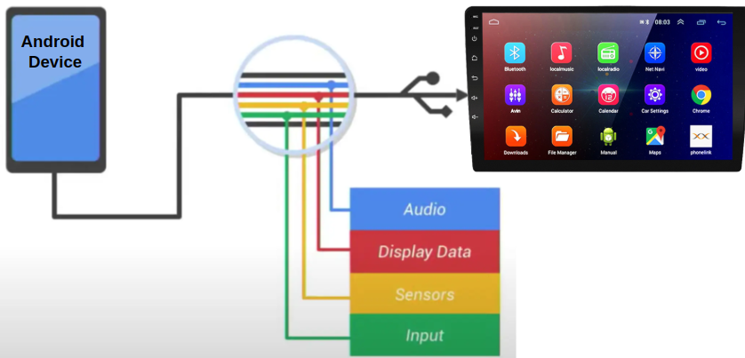
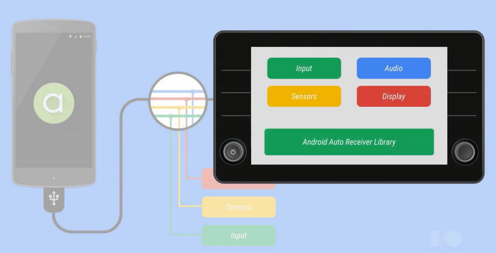
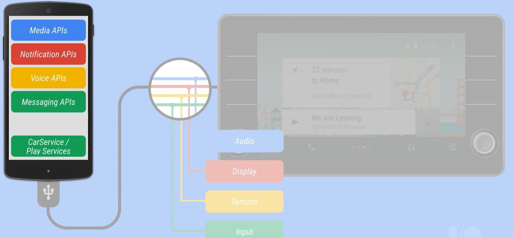

# Android Auto
### 1. What is Android Auto

Android Auto is a platform that connects an Android-powered smartphone to a vehicle’s **In-Vehicle Infotainment (IVI)** system, enabling a driver-friendly interface for apps such as navigation, media, and communication. It allows users to interact with their phone’s apps using the car's touchscreen, buttons, or voice commands while maintaining focus on the road.

To use Android Auto, an Android device with **Android 6.0** (or above) is required. **Android 10** and later come with Android Auto pre-installed, while older versions require installing the Android Auto app. It works through both wired (USB) and wireless (Wi-Fi) connections to the car’s head unit.

**Android Auto provides:**

- **Simplified Interface:** A UI optimized for quick access and minimal distraction.
- **Voice Interaction:** Google Assistant handles navigation, messages, and calls.
- **App Access:** Apps like Google Maps, Spotify, and messaging platforms are supported.
- **Cross-Device Support:** Works with various car models and phones.

The **Android Auto application** is not a standalone application but rather an extension of an existing regular Android application designed to be compatible with **Android Auto**, **Android Developers** build a specific module or functionality within their app that integrates with Android Auto.

If you have a music app like **Spotify**, the Android Auto integration allows Spotify (Regular Android App) to display a simplified interface with basic controls (play, pause, skip, etc.) on your car's infotainment screen while driving.

---------------

### 2. Android Auto Apps Categories

**2.1. Media Apps**

These apps are focused on providing entertainment and audio content, such as music, podcasts, and audiobooks. They are the most common category in Android Auto.

- **Examples**:
  - **Spotify** (for music streaming)
  - **YouTube Music** (for music streaming)
  - **Audible** (for audiobooks)
- **Features**:
  - Simple UI for browsing and controlling media.
  - Voice commands to play specific songs, albums, playlists, etc.
  - Quick access to media controls like play, pause, skip, and volume.

 **2.2. Navigation Apps**

These apps provide real-time directions, traffic updates, and routing to various destinations. They are essential for safe and efficient driving, especially for long trips or unfamiliar areas.

- **Examples**:
  - **Google Maps** (standard navigation app with traffic info, route planning)
- **Features**:
  - Turn-by-turn navigation with voice prompts.
  - Traffic, road closure, and alternate route suggestions.
  - Quick access to recent destinations and search functionality.

**2.3. Messaging Apps**

These apps allow users to receive and send messages while driving, using voice input to dictate responses, and text-to-speech for reading incoming messages.

- **Examples**:
  - **WhatsApp** (for text messaging and voice calls)
  - **Google Chat** (for texting and messaging services)
- **Features**:
  - Read incoming messages via text-to-speech.
  - Reply to messages using voice input, ensuring hands-free use.
  - Minimal UI to avoid distractions while driving.

**2.4. Point of Interest (POI) Apps**

These apps help drivers find local points of interest, such as gas stations, charging stations, restaurants, hotels, and tourist attractions.

- **Examples**:
  - **GasBuddy** (to find nearby gas stations and prices)
  - **ChargePoint** (for locating electric vehicle charging stations)
- **Features**:
  - Search for nearby services or places based on the user's current location.
  - Provide directions to those locations.

**2.5. Internet of Things (IoT) Apps**

IoT apps control smart devices in the home or vehicle from within the car. These can be used for tasks like opening garage doors, turning on lights, or adjusting the thermostat.

- **Examples**:
  - **Google Home** (for controlling smart home devices)
  - **Amazon Alexa** (for controlling Alexa-enabled devices)
- **Features**:
  - Ability to control IoT devices from the car's infotainment system.
  - Voice commands for managing smart home tasks.

#### Guidelines for all Android Auto Apps:

- **Safety First**: The Android Auto interface is designed to minimize distractions. It focuses on **voice control** and simple, clear UI elements to avoid taking attention away from driving.
- **Voice Interaction**: Android Auto heavily relies on voice commands for all categories, especially for messaging and navigation, ensuring that users can interact with their apps without needing to look at the screen.
- **Simplified UI**: The apps available on Android Auto feature a **minimalist design**, with large buttons, fewer choices on the screen, and a focus on the essential tasks for driving.

-----------------

### 3. How Android Auto Work

Android Auto enables communication between an **Android device** and the **car's head unit** (**IVI**). The primary purpose of Android Auto is to make the Android device compatible with the car's infotainment system, creating a seamless user experience for functions such as media playback, navigation, and messaging.

 #### 3.1. Android Auto Protocol

Android Auto uses a specialized protocol called the **Android Auto Protocol**, which is built on top of the **Android Open Accessory (AOA) protocol**. This protocol ensures communication between the mobile device (Android phone) and the car's head unit (IVI system) using multiple communication channels.

- **Transport Agnostic**: The protocol supports both **wired** (via USB) and **wireless** (via Wi-Fi) communication between the devices.
- **C++ Library**: Google provides a C++ library that car manufacturers integrate into their head units to support the Android Auto Protocol. This allows Android Auto to work on various car platforms like **Linux**, **Android**, and **QNX** (used by some manufacturers like BMW and Audi).

#### 3.2. Communication Channels between Android Device (Mobile) and Car IVI

Android Auto divides the communication into **four main channels** for efficient and prioritized data exchange between the Android device and the car's head unit:

- **Audio Channel**: For streaming audio, such as media or calls, from the Android device to the car’s head unit. This channel supports **bidirectional** communication for features like **hands-free calling** and **Google Assistant** integration.
- **Display Channel**: Responsible for displaying the user interface (UI) from the Android device onto the car's screen. The data flow is **unidirectional** — from the Android device to the head unit.
- **Input Channel**: Allows user input (via the car’s touch screen, buttons, or knobs) to be transmitted from the car's head unit to the Android device. This enables interaction with Android Auto apps, such as selecting a song or navigating to a destination.
- **Sensor Channel**: Transfers sensor data from the car to the Android device, such as GPS coordinates, speed, and other telemetry data that the Android Auto app might need.

All data between the two devices is formatted using **Protocol Buffers**, which ensure efficient serialization and deserialization of data for transmission over these channels.

>**Protocol Buffers (protobuf)** is a language-agnostic, platform-neutral, extensible mechanism developed by Google for serializing structured data. It is widely used for communication between different systems, particularly in environments where performance and efficiency are critical.
>
>Provide a robust solution for efficient data serialization and communication between systems. Its compact binary format and language-agnostic nature make it ideal for modern distributed systems, APIs, and storage, offering advantages over traditional formats like JSON and XML.

#### 3.3. The Process of Connection Between Mobile and Car (via Android Auto)

**3.3.1. Establishing Connection (Step 1)**

When an Android device is connected to the car's head unit, whether via USB (wired) or Wi-Fi (wireless), the first step is **authentication and identification** between the two devices using the **Android Auto Protocol**.

- **USB Mode**: In the case of a wired connection, the Android device is recognized as a **USB accessory**, and the car's head unit acts as the **host**.
- **Wireless Mode**: If the connection is wireless, the Android device and car's head unit communicate over Wi-Fi, but the Android Auto Protocol still governs the data exchange.

Once the connection is established, the **Car Session** is activated. This session allows the **Android Auto app** on the device to interact with the head unit.

**3.3.2. Displaying the Home Screen on the Car Display (Step 2)**

Once the Android Auto session is established, the Android device sends the **home screen UI** to the car’s head unit via the **Display channel**. This serves as the **starting point** for the Android Auto experience.

**3.3.3. Interacting with Android Auto Apps (Step 3)**

When the user taps on an app icon on the car’s screen (e.g., a media app like Spotify):

- **Input Event**: A touch event (including X and Y coordinates) is sent from the car’s head unit to the Android device through the **Input channel**.
- **App Activation**: The Android device processes this event, starts the selected app, and prepares the UI for display on the head unit.
- **Display Channel**: The app's UI is streamed back to the car's head unit using the **Display channel**.

**3.3.4. Playing Media (Step 4)**

If the user selects a song to play, the process involves multiple communication channels:

- **Input Channel**: The touch event to select the song is transmitted from the car's head unit to the Android device (Mobile).
- **App Processing**: The song is downloaded, processed, and prepared on the Android device.
- **Display Channel**: The "Now Playing" UI is sent back to the car's head unit to show the current track and controls.
- **Audio Channel**: The audio data for the selected song is streamed from the Android device to the car's head unit for playback.

#### 3.4. Car Head Unit  (IVI) Side

The car's **head unit** serves as a display to project the Android Auto app running on the phone. The head unit doesn't run the Android Auto app itself—it acts as a **receiver** and relies on a software stack to handle communication with the phone. The car head unit identifies the Android device and starts using the **Android Auto Protocol (AAP)** for communication.

#### 3.4.1. Android Auto Receiver Library

The **Android Auto Receiver Library ** acts as the **bridge** between the car hardware and the Android Auto app on the phone. It is not a standalone library; instead, it refers to a **software stack** that includes a set of protocols and interfaces designed for car hardware. This **Software Stack** is pre-installed on the car’s head unit. It’s a set of protocols and interfaces that allow the car’s hardware to communicate with Android Auto on the phone. Also, The **interfaces** for car hardware Provides APIs for handling:

- **Touch inputs**: Forwarded from the car screen to the phone.
- **Audio routing**: Integrates the car's audio system with Android Auto.
- **Display rendering**: Ensures proper scaling and aspect ratio for the car's screen (Android Auto UI on Car display).
- **Sensors and data**: (e.g., GPS, speed) shared if required.

**Automakers (OEMs)** need to integrate the Android Auto software stack into their head unitsar Hardware) and pass Google’s certification to ensure car compatibility with Android Auto.

#### 3.4. Android Device (Mobile) Side

When a phone connects to a car's head unit, the **Android Auto app** becomes the bridge between the car's hardware and the phone's Android operating system. This app provides APIs and services to project a seamless driving experience onto the car's display.

**3.4.1. Media API**

- **Purpose**: To provide a consistent interface for accessing and controlling media apps (e.g., Spotify, YouTube Music).
- **How it works :**
  - Media apps on the phone integrate with the Android Auto **Media API** to send metadata like song titles, album art, and playback controls to the car display.
  - When the driver interacts with media controls on the car (e.g., play, pause), these actions are sent back to the media app via the API.
- **Example**: You play a song on Spotify. The API sends the song's metadata and playback status to Android Auto, which forwards it to the car's display.

------

**3.4.2. Notification API**

- **Purpose**: To display notifications (e.g., incoming calls, messages, or app alerts) in a simplified and safe way.
- **How it works:**
  - The phone's apps push notifications to Android Auto via this API.
  - Android Auto formats the notifications for the car’s display and ensures they meet safety guidelines (e.g., large text, no distractions).
- **Example**: When you get a WhatsApp message, a notification appears on the car display. You can have it read aloud or respond via voice.

------

**3.4.3. Voice API**

- **Purpose**: Enables interaction with Android Auto using voice commands.
- **How it works:**
  - The Voice API integrates with Google Assistant to allow hands-free control.
  - Users can make calls, send messages, or navigate by saying commands like “Call John” or “Navigate to the nearest gas station.”
- **Example**: You press the voice command button on your steering wheel, and the Voice API triggers Google Assistant to process your request.

------

**3.4.4. Messaging APIs**

- **Purpose**: To enable safe and seamless communication via messaging apps.
- **How it works:**
  - Messaging apps (e.g., WhatsApp, Telegram) integrate with Android Auto using this API.
  - The API ensures messages are displayed in a driver-friendly format (e.g., large fonts) and allows voice dictation for replies.
- **Example**: When you receive a message, Android Auto displays it on the car screen and offers options to “Read” or “Reply” via voice.

------

**3.4.5. CarService / Google Play Services**

- **Purpose**: Manages the core communication between the phone and the car's head unit.
- **How it works:**
  - **CarService**: Handles low-level protocol communication with the car’s Android Auto Receiver stack.
  - **Google Play Services**: Ensures compatibility with all supported cars and handles updates to Android Auto functionality.
- **Example**: When you connect your phone, CarService handles the communication protocol (e.g., USB, Wi-Fi) to sync the phone and car.

------

### 4. **Drawbacks of Android Auto**

1. **Dependency on the Smartphone**

   - **Issue**: Android Auto requires a connected Android smartphone for it to function. If the phone's battery dies or connectivity is disrupted, the infotainment features stop working.
   - **Impact**: This reliance can create a less seamless user experience compared to a native system that runs directly in the car.

2. **Limited Access to Vehicle Features**

   - **Issue**: Android Auto primarily operates as a projection system for apps like navigation, media, and messaging. It cannot deeply integrate with car-specific features such as climate control, advanced driver-assistance systems (ADAS), or vehicle sensors.
   - **Impact**: Drivers need to switch between Android Auto and the car's native interface for certain functions, leading to fragmentation.

3. **Performance Limitations**

   - **Issue**: The quality of the experience is tied to the phone’s performance. Older or slower phones may lead to laggy or inconsistent performance.
   - **Impact**: This inconsistency can result in frustration, particularly during demanding tasks like navigating or streaming media.

4. **Connectivity Issues**

   - **Issue**: Android Auto requires a wired USB connection (in many cars) or wireless connectivity (in newer cars). Connectivity issues, such as unreliable wireless connections or incompatible USB cables, can disrupt usage.
   - **Impact**: These issues can hinder the convenience of the system, especially during long trips.

5. **Limited Customization**

   - **Issue**: Android Auto has a standardized interface and app ecosystem, which limits automakers from customizing the system to fit their brand identity or add unique features.
   - **Impact**: Automakers cannot differentiate their in-car experiences, making Android Auto feel generic compared to branded systems.

6. **App Restrictions**

   - **Issue**: Android Auto has strict guidelines for app developers, limiting the types of apps that can be used. For example, only navigation, media, and messaging apps are officially supported.
   - **Impact**: This restricts the ecosystem and limits the types of services available to users.

   

7. **Compatibility Issues**

   - **Issue**: Android Auto is not supported by all cars or head units, and older models often lack the necessary hardware or software updates to enable it.
   - **Impact**: Users with older cars may need to invest in third-party head units to access Android Auto.

