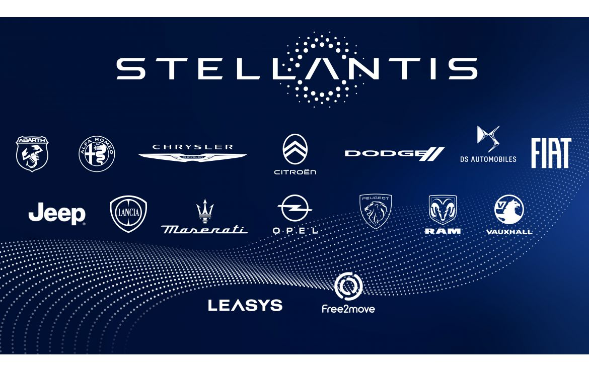

#  Android Automotive OS [AAOS]

**Android Automotive OS (AAOS)** is an open-source operating system designed to run directly on a vehicle's hardware. Unlike **Android Auto**, which relies on a smartphone to project content onto the car's infotainment system, Android Automotive is a standalone system embedded within the car itself. This means it manages not only infotainment features but also vehicle-specific systems such as climate control, navigation, and advanced vehicle settings.

### 1. **Why AAOS Was Developed ?**

Due to **Android Auto** limitations, Google developed **Android Automotive OS (AAOS)**, which provides a **native operating system** that runs directly on the car's head unit. Here's how AAOS overcomes Android Auto’s drawbacks:

1. **Eliminates Smartphone Dependency**
   - AAOS is installed directly on the car’s hardware, meaning it can operate independently of a smartphone.
   - The system supports embedded apps, so users don’t need to connect their phones to access infotainment features.
2. **Deeper Integration with Vehicle Features**
   - AAOS allows automakers to integrate with vehicle-specific controls (e.g., climate control, seat adjustments, ADAS) using the **Vehicle HAL (Hardware Abstraction Layer)**.
   - This provides a unified interface for managing all car functions.
3. **Improved Performance**
   - AAOS runs on the car’s hardware, ensuring a consistent and smooth user experience that isn’t dependent on phone specifications.
4. **Enhanced Connectivity**
   - AAOS supports over-the-air (OTA) updates for software and apps, eliminating the need for a phone to provide updates or new features.
5. **Customizability for Automakers**
   - Automakers can customize the AAOS interface and features to align with their brand identity while still leveraging the Android ecosystem.
6. **Expanded App Ecosystem**
   - AAOS supports a growing ecosystem of apps, including navigation, media, and even vehicle-specific apps, thanks to the **Google Play Store for AAOS**.
7. **Unified Experience**
   - The experience is consistent across cars that use AAOS, reducing fragmentation and ensuring a familiar interface for users switching between vehicles.

### 2. Why use Android in Automotive 

1. **Complete System Integration**: Android Automotive OS enables seamless integration of both automotive-specific and infotainment features. It provides a unified platform for multimedia, vehicle systems, and Google services, offering a rich user experience while managing various car components such as navigation, climate control, and diagnostics. For example, Android Automotive integrates with a car's hardware to control the air conditioning and display the vehicle’s health metrics in real-time.
2. **Enhanced User Experience**: AAOS supports Google’s suite of services, including **Google Maps**, **Google Assistant**, and the **Google Play Store**. This allows drivers to access navigation, entertainment, and hands-free control through voice commands, enhancing the in-car experience. For instance, a driver can easily request directions, play music, or check the weather through Google Assistant without taking their hands off the wheel.
3. **Customization and Flexibility**: The Android Open Source Project (AOSP) serves as the foundation for Android Automotive, providing developers with full control over the operating system. This flexibility enables car manufacturers to customize the user interface, integrate proprietary vehicle features, and continuously update the system. A manufacturer like **Volvo** used AOSP to create a customized Android-based infotainment system that integrates with their vehicle’s hardware, offering a unique brand experience while maintaining the functionality of Google’s services.
4. **Cost-Effectiveness**: As an open-source platform, AOSP eliminates licensing costs that are often associated with proprietary operating systems. This can significantly reduce costs for automakers (OEMs) when developing custom in-car systems. For example, manufacturers can invest resources into hardware integration and unique features instead of spending on expensive software licenses.
5. **Support for Advanced Visuals**: Android Automotive supports high-quality graphics, animations, and 3D visuals essential for creating engaging digital cockpits and infotainment systems. With the ability to use **OpenGL ES** and **Vulkan** graphics, developers can build sophisticated, visually appealing UIs that provide clear, responsive, and engaging experiences for drivers and passengers alike.
6. **Broad Ecosystem and Community Support**: The widespread adoption of Android means that the automotive industry can leverage a large pool of skilled developers and a vibrant community of contributors. AOSP benefits from a global network of developers who continue to enhance the platform, making it easier to integrate the latest innovations and ensure that Android Automotive remains up-to-date with new technologies and hardware.
7. **Control Over Updates and Security**: Since AOSP is open-source, manufacturers have complete control over their system’s updates, feature additions, and security patches. This level of control is particularly important in the automotive sector, where security and reliability are paramount. Automakers can ensure that their systems are secure, compliant with industry standards, and equipped with the latest features, such as real-time software updates or over-the-air (OTA) updates.

### 3. Android Automotive in Vehicles

1. **Volvo**: Volvo was one of the first automakers to integrate **Android Automotive OS** in its vehicles, offering a fully integrated infotainment system powered by AOSP. By customizing Android, Volvo embedded **Google services** such as **Google Assistant**, **Google Maps**, and the **Google Play Store**, directly into their cars. This deep integration allows for personalized in-car experiences, such as tailored climate controls, navigation, and media management. For example, **Google Maps** provides navigation with real-time traffic updates, and **Google Assistant** enables voice commands for hands-free control of various car functions. Since AOSP is open-source, Volvo could opt for third-party alternatives if they chose not to rely on Google services. This flexibility means that if Volvo wanted to, they could replace Google Maps with another navigation app or Google Assistant with a custom voice recognition solution, providing a more independent or customized in-car experience.

2. **General Motors (GM)**: General Motors has also adopted **Android Automotive** in their vehicles, embedding **Google Assistant**, **Google Maps**, and the **Google Play Store** into their infotainment systems. By using **Google Automotive Services (GAS)**, GM offers seamless connectivity with Google’s ecosystem, providing customers with a familiar Android experience, including access to Google’s apps and services. For example, GM vehicles can use **Google Maps** for turn-by-turn navigation and **Google Play Store** for downloading apps directly to the infotainment system. However, GM retains the option to remove Google-specific components if they choose. They could replace Google Maps with their own navigation system or develop a third-party app to replace **Google Assistant**, creating a more independent and customized in-car experience.

3. **Stellantis (Maserati)**: In contrast, Stellantis, the maker of **Maserati**, has chosen to partner with **Amazon** for its in-car services. Instead of integrating **Google Automotive Services (GAS)**, Stellantis uses **Amazon’s Alexa** for voice commands, and other third-party applications for navigation and media management. This partnership enables Stellantis to avoid using Google's ecosystem, opting instead for Amazon’s services like **Alexa** for voice assistance and **Amazon’s app ecosystem** for other vehicle functions. For example, Maserati vehicles might use **Alexa** for controlling media, navigation, and other in-car systems, providing an alternative to **Google Assistant**.

   

4. **Renault-Nissan-Mitsubishi Alliance**: The Renault-Nissan-Mitsubishi Alliance has similarly embraced **AOSP** for their vehicles, and while some models include **Google Automotive Services (GAS)**, they have the flexibility to choose whether to integrate Google services. In many cases, the Alliance uses **Google Assistant** and **Google Maps** in their vehicles to provide users with the familiar Android experience. However, AOSP's open-source nature allows the Alliance to remove Google services if needed and implement their own third-party applications. For instance, if the Renault-Nissan-Mitsubishi Alliance chooses not to rely on Google services, they can replace **Google Maps** with custom navigation apps or introduce other third-party voice assistants to suit their vehicles' needs.

## 4. Android Auto  Vs Android Automotive OS

### 4.1. Android Auto

Android Auto is an application that allows an Android smartphone to project its interface onto the car’s infotainment screen. This system enables drivers to safely use essential mobile apps, such as Google Maps, Spotify, and messaging apps, while driving. The car’s infotainment system acts as a secondary display, while all processing is handled by the phone.

- **Platform**: Android Auto runs on an Android smartphone and **projects its interface onto the car’s infotainment screen**.
- **Connection**: Requires the driver’s smartphone to connect via USB or wirelessly (if supported by the vehicle).
- **Interface**: Mirrors a simplified version of Android optimized for driving, providing access to essential apps in a driver-friendly format.
- **Control**: The phone handles all processing, and the car’s infotainment system displays the user interface. The car screen acts as a touch interface for controlling apps.
- **Customization**: Automakers have limited ability to customize Android Auto; users interact with apps designed for Android Auto by third-party developers.

**In short**: Android Auto is a **projection-based solution** that relies on the driver’s smartphone to provide navigation, media, and communication features.

#### 4.1.1. How Android Auto Works

#####  4.1.1.1. **How Data from Mobile Appears on the Car Screen**

When the smartphone is connected (via USB or wirelessly, depending on the vehicle), Android Auto **projects** the mobile app's interface onto the car's infotainment screen. Instead of displaying the full phone screen, only a simplified, in-car-friendly version of the app is shown. Common apps such as **Google Maps**, **Spotify**, and **messaging apps** are displayed in this optimized format.

##### 4.1.1.2. **Interaction Between Car Screen and Phone**

The car’s screen serves as an interactive display. When you touch the car screen:

- The **car’s infotainment system** sends a signal to the **phone**.
- The **phone processes the touch input** and responds by performing actions within the app, such as navigating, playing music, sending a message, or adjusting settings.

**Example**: If you tap the **Google Maps** icon on the car’s screen, it sends a signal to the phone, which opens Google Maps and displays the navigation instructions. If you interact with the map (e.g., zooming in or selecting a route), the phone processes the touch input and updates the map displayed on the car screen.

---------------------------------------

### 4.2. Android Automotive  AAOS

Android Automotive OS (AAOS) is a **full, standalone operating system** designed to run directly on the car’s hardware. Unlike Android Auto, which relies on a connected smartphone, Android Automotive OS operates independently, providing a native in-car experience. It’s specifically adapted for automotive needs, integrating deeply with the vehicle's systems for a highly customizable experience.

- **Platform**: Android Automotive OS is a **full operating system** that runs directly on the car's hardware, similar to Android but tailored for automotive use.
- **Connection**: Does **not require a smartphone**; the OS is embedded into the car, meaning it operates independently of the user’s phone.
- **Interface**: Provides a **fully customized interface** that integrates with the car’s built-in systems. It allows users to control in-car features (such as climate control, seat adjustments, etc.) as well as media and navigation without needing a smartphone.
- **Control**: All processing is done by the car’s **onboard hardware**, which makes Android Automotive faster and more responsive compared to Android Auto, as it doesn’t rely on a connected device.
- **Customization**: Automakers can **fully customize** the operating system, the user interface, and even add manufacturer-specific apps, services, and controls that aren't available with Android Auto.

**In short**: Android Automotive OS is an **embedded operating system** that runs natively in the vehicle, providing a more integrated and customizable in-car experience.

#### 4.2.1. How Android Automotive OS Works

- **How Data and Interface Appear on the Car Screen**

Unlike Android Auto, which mirrors the smartphone’s interface, **Android Automotive OS** provides a fully integrated and customized interface directly on the car’s screen. The OS can manage vehicle-specific controls (e.g., climate control, seat adjustments) and media applications without the need for an external smartphone.

- **Interaction with the Car's Systems**

Android Automotive OS interacts directly with the car’s **hardware** and **vehicle-specific systems**. The operating system integrates with functions such as:

- **Climate control**
- **Seat adjustments**
- **Navigation**
- **Media and entertainment**

Since everything runs natively on the car’s hardware, you can control these features without needing to connect a smartphone.

- **Customization by Automakers**

One of the main advantages of Android Automotive OS is that it allows **automakers** to fully customize the system to suit their vehicles. This means that the user interface, available apps, and vehicle controls can be tailored to the brand’s specific needs and user experience requirements.

For example, manufacturers can add custom controls for vehicle features, such as:

- In-car climate settings
- Custom entertainment services
- Specialized car diagnostics

This level of customization is not available with Android Auto, which is designed to work across all vehicles in a standardized way.

| Feature                    | Android Auto              | Android Automotive OS (AAOS)             |
| -------------------------- | ------------------------- | ---------------------------------------- |
| **Requires Smartphone**    | Yes                       | No                                       |
| **Processing Power**       | Smartphone                | Car’s onboard hardware                   |
| **Customization for OEMs** | Limited                   | Extensive                                |
| **System Integration**     | Low (display-only)        | High (can control vehicle functions)     |
| **Examples of Automakers** | Compatible with most cars | Volvo, Polestar, GM, Renault, Stellantis |

### 5. Why Use **Android Automotive** OS Instead of **Embedded Linux** in Vehicles ?

**Android Automotive** and **Embedded Linux** are both popular platforms used in the development of in-car infotainment systems, but they offer distinct advantages based on the needs of modern automotive applications. Here's a breakdown of why **Android Automotive** might be preferred over **Embedded Linux** in certain situations:

#### 5.1. **User Experience (UX) and Ecosystem Integration**

- **Android Automotive**: One of the main advantages of Android Automotive is its **tight integration with Google's services and apps**, which are widely used by consumers. This includes access to popular applications such as **Google Maps**, **YouTube**, and **Spotify**, along with the integration of **Google Assistant  AI** for voice commands. The **Google Play Store** is also a significant benefit, enabling the installation of a wide range of apps directly onto the vehicle's infotainment system.

  This **ecosystem advantage** makes Android Automotive a natural choice for car manufacturers that want to deliver a rich user experience that aligns with what drivers and passengers are familiar with on their mobile devices.

- **Embedded Linux**: While **Embedded Linux** offers a more flexible and customizable platform, it lacks the same level of ecosystem integration that Android provides. Although you can create a tailored user interface and integrate third-party apps, it requires more development effort and lacks direct access to the vast array of apps and services that Android Automotive offers.

#### 5.2. **Development Speed and Efficiency**

- **Android Automotive**: Android Automotive is built on top of **AOSP (Android Open Source Project)** and provides a set of **predefined frameworks, APIs, and services** that are specifically designed for automotive use. For example, it has built-in support for **vehicle-specific features** such as navigation, media playback, climate control, and communication with car sensors. These built-in functionalities significantly reduce the time required for development, as car manufacturers can leverage Android’s mature platform rather than building everything from scratch.

  Additionally, developers familiar with Android development tools (such as **Android Studio**) can easily transition to working with Android Automotive. This **faster development cycle** helps automotive companies get products to market more quickly.

- **Embedded Linux**: With **Embedded Linux**, developers have to **build everything from the ground up**, including creating their own middleware, drivers, and integrating with vehicle-specific hardware. While this gives more flexibility in the design, it also means more time is spent on development, testing, and integration.

#### 5.3. **Over-the-Air (OTA) Updates and Maintenance**

- **Android Automotive**: One of the standout features of Android Automotive is its built-in support for **over-the-air (OTA) updates**. Manufacturers can push updates to the vehicle’s infotainment system directly to fix bugs, add new features, or update applications. This simplifies the process of maintaining and improving the system post-sale, ensuring that the infotainment system remains up-to-date with the latest features and security patches.
- **Embedded Linux**: While **Embedded Linux** also supports OTA updates, it is not inherently built into the platform. Implementing OTA update mechanisms on an Embedded Linux system requires additional tools and custom development, which can increase the complexity and cost.

#### 5.4. **Standardization and Vendor Support**

- **Android Automotive**: As a platform backed by **Google**, Android Automotive benefits from **continuous support, updates, and a standardized approach** to automotive infotainment. It is quickly becoming the go-to platform for many car manufacturers, including **Volvo**, **Audi**, **Ford**, and others, who use Android Automotive in their vehicles. Google also provides tools for **app developers** to create Android apps specifically tailored to the automotive environment.
- **Embedded Linux**: While **Embedded Linux** is widely used in many industries, including automotive, it lacks the level of **standardization** and **vendor support** that Android Automotive has in the car industry. This can lead to inconsistencies across different manufacturers and create challenges for app developers who must design their apps for multiple, potentially incompatible, Linux-based systems.

#### 5.5. **Rich Media and Connectivity**

- **Android Automotive**: Android Automotive is designed with modern media and connectivity in mind. It has **native support for media streaming, navigation, and cloud-based services**, and can integrate with **smartphone apps** via **Android Auto**. It also supports **Bluetooth**, **Wi-Fi**, and other connectivity options that are essential for the connected car experience.

  Moreover, with access to **Google Assistant**, drivers can use voice commands to control their vehicle's functions, which enhances the overall driving experience.

- **Embedded Linux**: Embedded Linux also supports media and connectivity, but it often requires more custom development to support these features. Although Linux has excellent support for networking, USB devices, and Bluetooth, building a **seamless media experience** requires more effort compared to Android Automotive’s out-of-the-box capabilities.

#### 5.6. **Hardware Support and Customization**

- **Android Automotive**: Android Automotive can run on a wide range of hardware platforms, from low-end systems to high-performance multi-core processors. Google partners with multiple hardware vendors to optimize Android Automotive for various automotive requirements.

- **Embedded Linux**: Embedded Linux is extremely **flexible** and can be highly customized for specific hardware configurations. However, this requires developers to have deep expertise in Linux kernel development and the hardware specifics of the target vehicle. It can be more difficult to scale across different hardware platforms without considerable rework.

#### 5.7. **Security**

- **Android Automotive**: Since Android Automotive is a platform maintained by **Google**, it benefits from the company’s **security practices**. Android updates frequently include security patches, ensuring that vehicles remain protected against new vulnerabilities. Additionally, Android Automotive uses robust **sandboxing techniques** to ensure apps run in isolated environments, which enhances security.
- **Embedded Linux**: While **Embedded Linux** can be secure when configured properly, it lacks the **same level of ongoing security support** that Android Automotive gets from Google. Embedded Linux systems may require additional security measures to be built in manually, which can increase the development burden.