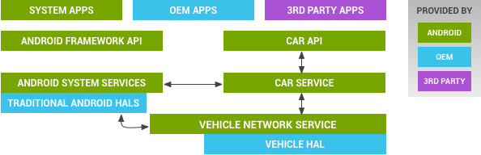
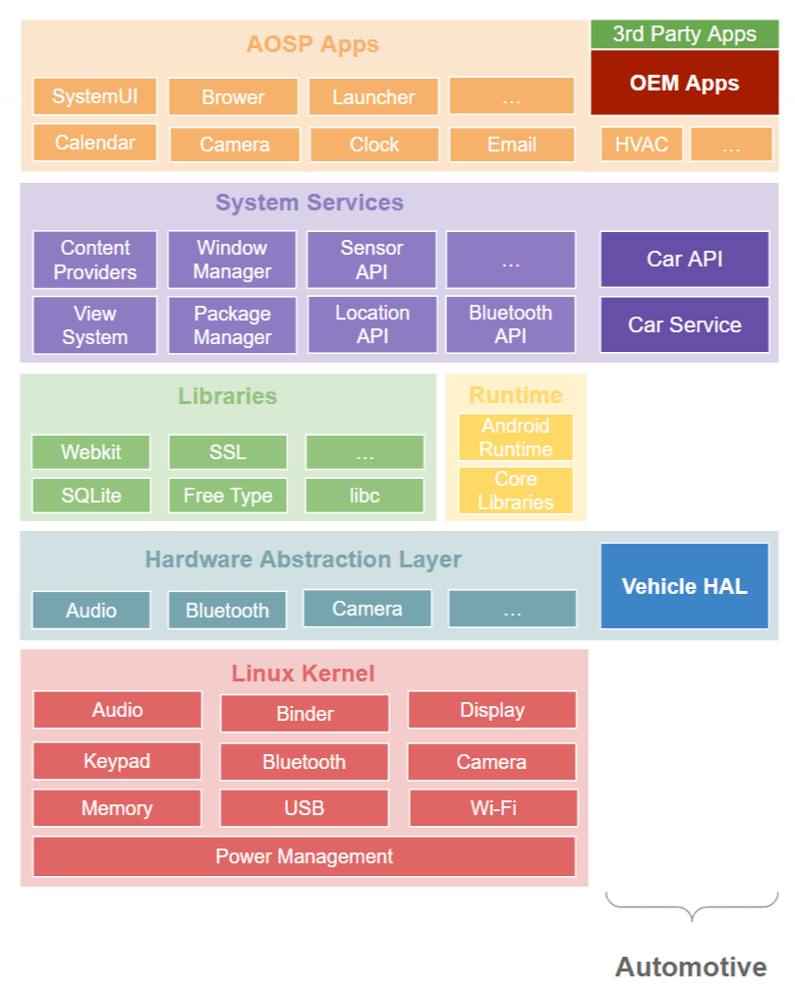

# Android Automotive [AAOS] Architecture

### 1. AAOS Architecture

Android Automotive OS (AAOS) is a version of Android tailored specifically for in-vehicle infotainment (IVI) systems. It extends the Android platform with vehicle-related APIs and services, allowing apps to interact  with car hardware while ensuring safety and performance.

The architecture comprises multiple layers to provide seamless interaction between **apps**, **Android framework**, and **vehicle hardware**:

- **Application Layer**: Automotive-specific apps (media, navigation, HVAC, etc.).
- **Android Framework Layer**: Extensions to the Android SDK with automotive-specific libraries and services.
- **Vehicle HAL (Hardware Abstraction Layer)**: Interface to access vehicle-specific data like speed, fuel level, etc.
- **Linux Kernel Layer**: Underlying OS that interacts with vehicle ECUs via CAN Bus or other protocols.

#### 2. **Application Layer**

- **Automotive Apps**: Apps designed specifically for in-car use cases, like:

  - Media players (Spotify, YouTube Music).
  - Navigation (Google Maps).
  - Voice assistants.
  - Custom OEM apps for climate control, seat adjustment, HVAC, etc.

  - Apps interact with the vehicle through the **Car Library** and **Car API**.
  - Apps are sandboxed to ensure user data safety and prevent malicious activity.

------

#### 3. **Car API and Library** (Framework layer)

- The **Car API** (part of the Android SDK) provides an interface for apps to:
  - Access vehicle-specific data (e.g., fuel level, speed, RPM, location).
  - Interact with vehicle-specific controls (e.g., HVAC, lights).
  - Ensure compliance with driver distraction guidelines.
- The **Car Library** includes:
  - **AIDL interfaces** (e.g., `ICarImpl`) for app-to-framework communication.
  - Automotive UI components for consistent design.

------

#### 4. **Car Service**

- **Car Service** is the core service running in the Android system server, providing automotive-specific functionality.
- It acts as a bridge between:
  - **Car Library**. 
  - **Vehicle HAL** (hardware layer).
- **Responsibilities:**
  - Abstracts vehicle-specific details for apps.
  - Handles communication via **AIDL**  interfaces to talk to the hardware.
  - Implements safety-critical features.

------

#### 5. **Vehicle HAL (Hardware Abstraction Layer)**

- The **Vehicle HAL** is the critical interface between Android and the vehicle hardware (ECUs).

- It defines a standard set of vehicle properties, such as:

  - Speed.
  - Fuel level.
  - Climate control.
  - Gear position.
  - Door status (open/closed).

  - Uses **AIDL** (Android Interface Definition Language) for communication.
  - Abstracts the details of the CAN Bus or other vehicle communication protocols.

------

#### 6. **Vehicle ECUs and Communication**

- ECUs (Electronic Control Units) are the vehicle's hardware modules responsible for specific subsystems (e.g., braking, engine control, infotainment).
- Android Automotive communicates with ECUs via:
  - **CAN Bus** or other vehicle network protocols (e.g., LIN, FlexRay, Ethernet).
  - The Vehicle HAL ensures compatibility and standardization.

------

### **7. Full Android Automotive OS Stack**

#### 7.1. **App Layer**:

- Automotive apps (media, navigation, climate control).
- Apps interact with the **Car Library** to access vehicle data.

#### 7.2. **Framework Layer**:

- Includes automotive extensions to the Android framework.
- Contains **Car Service** to manage vehicle-specific data and interactions.

#### 7.3. **Native C++ Layer**:

#### 7.4. Vehicle HAL [VHAL] Layer:

The bridge between Android and the vehicle hardware (ECUs).

#### 7.5. **Kernel Layer**:

- Implements drivers and interfaces for vehicle communication.
- Manages hardware resources (e.g., CAN Bus, Ethernet).

------

### **8. Comparison with Standard Android Architecture**

| **Layer**           | **Android OS**                  | **Android Automotive OS**                         |
| ------------------- | ------------------------------- | ------------------------------------------------- |
| **App Layer**       | Apps using Android SDK          | Automotive-specific apps using Car APIs           |
| **Framework**       | Android Framework APIs          | Extended APIs for vehicle-specific use cases      |
| **System Services** | General-purpose system services | Car Service for vehicle data and control          |
| **HAL**             | Hardware Abstraction Layer      | Vehicle HAL to access ECUs                        |
| **Kernel**          | Linux Kernel                    | Linux Kernel with vehicle communication protocols |

------

