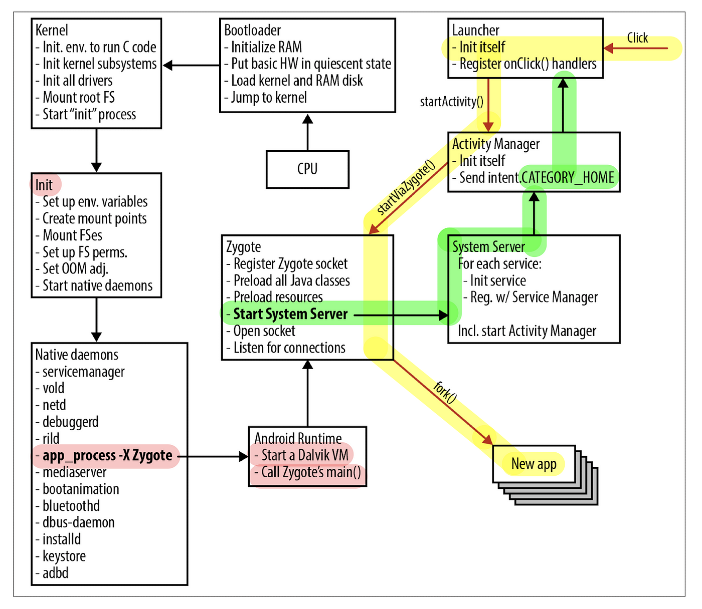

# Android OS Booting Sequence





### 1. **Boot ROM Stage**

- Purpose:
  - This is the first stage executed when the device is powered on.
  - The Boot ROM, a part of the device's firmware, initializes the hardware and locates the bootloader in persistent storage.
- Steps:
  - Performs a hardware-level initialization.
  - Checks for the bootloader in storage (e.g., eMMC, UFS, or SD card).
  - Loads the bootloader into RAM.
- **Outcome:** The bootloader is identified and executed.

------

### 2. **Bootloader Stage**

- Purpose:
  - The bootloader is responsible for loading the kernel and initial ramdisk (initrd).
  - It may provide options for fastboot, recovery, or normal boot modes.
- Steps:
  - Verifies the integrity of the kernel and other critical components (secure boot).
  - Loads the Linux kernel and initrd into memory.
  - Passes control to the kernel.
- **Outcome:** Prepares the kernel and initrd for execution.

**2.1. Primary Bootloader Stage 1 [BL1]**

- **Purpose:**
  - The primary bootloader is minimal and designed to execute as quickly as possible.
  - It initializes essential hardware components and verifies the integrity of the secondary bootloader.
- **Steps:**
  - Performs basic hardware initialization (e.g., CPU, RAM, clocks, and power management).
  - Locates and validates the secondary bootloader (e.g., using cryptographic signatures).
  - Loads the secondary bootloader into memory.
- **Why Needed:**
  - A small and simple primary bootloader minimizes the risk of errors and ensures that only authenticated software is executed next (secure boot).
  - It acts as a safety layer, particularly for embedded systems, where recovery options are limited.

**2.2. Secondary Bootloader Stage 2 [Uboot]**

- Purpose:
  - The secondary bootloader is more complex and capable of handling advanced initialization tasks.
  - It loads the operating system kernel and passes control to it.
- Steps:
  - Configures more hardware settings, such as display, networks and storage.
  - Verifies and loads the operating system kernel and initial ramdisk (initrd).
  - May offer user-facing options, such as entering fastboot mode, recovery mode, or normal boot.
- Why Needed:
  - The secondary bootloader provides flexibility to handle various boot options and system configurations.
  - It allows interaction with the user (e.g., choosing a recovery mode or flashing firmware).
  - Splitting responsibilities between two stages keeps the overall bootloader design modular and secure.

> **Why Are Two Stages Needed?**
>
> 1. **Security:**
>    - The primary bootloader is typically embedded in ROM and is highly secure. It ensures that only verified secondary bootloaders are executed, preventing unauthorized or malicious code from running.
> 2. **Modularity:**
>    - Separating responsibilities into two stages allows the primary bootloader to remain simple and static while the secondary bootloader can be updated or customized for specific hardware without modifying the core boot code.
> 3. **Efficiency:**
>    - The primary bootloader is minimal and executes quickly to save time and resources during the initial power-up phase.
>    - The secondary bootloader can be more feature-rich and handle complex tasks without compromising boot speed.
> 4. **Recovery:**
>    - If the secondary bootloader or OS becomes corrupted, the primary bootloader can still provide a fallback mechanism for recovery or re-flashing.
>
> ------


### 3. **Kernel Stage**

- Purpose:
  - The kernel is the core of the operating system that manages hardware and system resources.
- Steps:
  - Initializes the system's hardware (drivers for CPU, memory, input/output devices, etc.).
  - Mounts the root filesystem (usually from the initrd or system partition).
  - Starts the `init` process.
- **Outcome:** System resources are managed and initialized, and the control is handed over to `init`.

------

### 4. **Init Stage**

- Purpose:

  - The `init` process is the first user-space process. It is responsible for system configuration and service management.

- Steps:

  - Mounts filesystems (e.g., `/system`, `/data`, `/cache`).
  - Setup **SE Linux** Policies.
  - Reads the configuration files (`init.rc` and other `.rc` files).
  - Starts critical daemons (e.g., `servicemanager`, `vold`, `netd`).
  - Starts the Zygote process.

- **Outcome:** Prepares the system environment and spawns the Zygote process.

- To go through android source code go to `aosp/system/core/init`

  ```c++
  /*
   * Copyright (C) 2018 The Android Open Source Project
   *
   * Licensed under the Apache License, Version 2.0 (the "License");
   * you may not use this file except in compliance with the License.
   * You may obtain a copy of the License at
   *
   *      http://www.apache.org/licenses/LICENSE-2.0
   *
   * Unless required by applicable law or agreed to in writing, software
   * distributed under the License is distributed on an "AS IS" BASIS,
   * WITHOUT WARRANTIES OR CONDITIONS OF ANY KIND, either express or implied.
   * See the License for the specific language governing permissions and
   * limitations under the License.
   */
  
  #include "builtins.h"
  #include "first_stage_init.h"
  #include "init.h"
  #include "selinux.h"
  #include "subcontext.h"
  #include "ueventd.h"
  
  #include <android-base/logging.h>
  
  #if __has_feature(address_sanitizer)
  #include <sanitizer/asan_interface.h>
  #elif __has_feature(hwaddress_sanitizer)
  #include <sanitizer/hwasan_interface.h>
  #endif
  
  #if __has_feature(address_sanitizer) || __has_feature(hwaddress_sanitizer)
  // Load asan.options if it exists since these are not yet in the environment.
  // Always ensure detect_container_overflow=0 as there are false positives with this check.
  // Always ensure abort_on_error=1 to ensure we reboot to bootloader for development builds.
  extern "C" const char* __asan_default_options() {
      return "include_if_exists=/system/asan.options:detect_container_overflow=0:abort_on_error=1";
  }
  
  __attribute__((no_sanitize("address", "memory", "thread", "undefined"))) extern "C" void
  __sanitizer_report_error_summary(const char* summary) {
      LOG(ERROR) << "Init (error summary): " << summary;
  }
  
  __attribute__((no_sanitize("address", "memory", "thread", "undefined"))) static void
  AsanReportCallback(const char* str) {
      LOG(ERROR) << "Init: " << str;
  }
  #endif
  
  using namespace android::init;
  
  int main(int argc, char** argv) {
  #if __has_feature(address_sanitizer)
      __asan_set_error_report_callback(AsanReportCallback);
  #elif __has_feature(hwaddress_sanitizer)
      __hwasan_set_error_report_callback(AsanReportCallback);
  #endif
      // Boost prio which will be restored later
      setpriority(PRIO_PROCESS, 0, -20);
      if (!strcmp(basename(argv[0]), "ueventd")) {
          return ueventd_main(argc, argv);
      }
  
      if (argc > 1) {
          if (!strcmp(argv[1], "subcontext")) {
              android::base::InitLogging(argv, &android::base::KernelLogger);
              const BuiltinFunctionMap& function_map = GetBuiltinFunctionMap();
  
              return SubcontextMain(argc, argv, &function_map);
          }
  
          if (!strcmp(argv[1], "selinux_setup")) {
              return SetupSelinux(argv);
          }
  
          if (!strcmp(argv[1], "second_stage")) {
              return SecondStageMain(argc, argv);
          }
      }
  
      return FirstStageMain(argc, argv);
  }
  ```

  

------

### 5. **Zygote Stage**

Zygote is a pre-initialized process that serves as a template for launching new applications. It is the parent of all android processes. It Initializes the Java runtime environment (Dalvik/ART), preloads system libraries and resources and listens for requests to fork and launch application processes.

**How Zygote Works**

**5.1. Startup:**

- The `init` process reads the `init.rc` configuration file and starts Zygote by executing the `app_process` binary.
- Zygote initializes the Android Runtime (ART or Dalvik, depending on the Android version).

**5.2. Preloading:**

- Zygote preloads common system libraries, classes, and resources, including:
  - Core Java libraries (e.g., `java.lang`, `android.*`).
  - System-wide resources like fonts and themes.
  - Graphics and UI frameworks.
- This preloading ensures that these resources are already in memory and can be shared across all app processes.

**5.3. Socket Listening:**

- Zygote creates a socket and listens for requests from the **Activity Manager Service** (AMS).
- When the AMS requests a new application process, Zygote "forks" itself to create a new process.

**5.4. Process Forking:**

- The Zygote process forks to create a new process for the requested application.

- Forking is efficient because the parent and child processes share memory pages for preloaded resources (via **copy-on-write**).

  >**Copy-on-Write (COW)** is an optimization technique used in memory management to efficiently share data between processes. It allows multiple processes to share the same memory pages initially, but ensures that changes to those pages are made in a way that preserves data integrity.
  >
  >Here’s a detailed explanation:
  >
  >**How Copy-on-Write Works :**
  >
  >1. **Shared Memory Pages:**
  >   - When a process (e.g., Zygote) forks a child process, the child process doesn't get an immediate copy of all the parent's memory.
  >   - Instead, both the parent and child processes share the same memory pages for read-only or unmodified data.
  >2. **Marking Pages as Read-Only:**
  >   - The operating system marks the shared memory pages as **read-only**.
  >   - This means neither the parent nor the child can write to these pages directly.
  >3. **Creating a Copy on Write:**
  >   - If either process (parent or child) attempts to modify a shared page, the operating system detects this through a **page fault**.
  >   - At that point, the operating system creates a **private copy** of the page for the modifying process.
  >   - This ensures that changes made by one process do not affect the other.
  >4. **Separation After Modification:**
  >   - After a copy is created, the two processes have separate copies of the modified page, but unchanged pages remain shared.
  >
  >

- Only modified pages are duplicated, saving both memory and time.

**5.5. Customization:**

- After forking, the child process:
  - Customizes itself based on the requested application package.
  - Loads the app-specific classes and resources.
  - Starts the main app thread and executes the app's code.

- **Outcome:** Prepares the system for application execution and optimizes app startup times.

------

### 6. **System Server Stage**

- Purpose:
  - The `SystemServer` process is responsible for starting and managing Android's core system services.
- Steps:
  - Starts key system services like Activity Manager, Package Manager, Window Manager, etc.
  - Manages overall system functionality and inter-process communication (IPC).
- **Outcome:** The system services are up and running, making the device functional.

------

### 7. **Home Screen/Launcher Stage**

- Purpose:
  - Displays the user interface and allows user interaction with the system.
- Steps:
  - Starts the home screen or launcher application.
  - Handles user input and interaction.
- **Outcome:** The device is ready for user interaction.

------

### Summary of Purpose for Each Stage

| **Stage**         | **Purpose**                                                  |
| ----------------- | ------------------------------------------------------------ |
| **Boot ROM**      | Hardware initialization and bootloader loading.              |
| **Bootloader**    | Kernel and initrd loading, integrity verification.           |
| **Kernel**        | Hardware management and starting the `init` process.         |
| **Init**          | Filesystem mounting, daemon initialization, and starting Zygote. |
| **Zygote**        | Pre-initialized template for launching applications.         |
| **System Server** | Managing core system services and overall system operation.  |
| **Home Screen**   | User interface and interaction with the device.              |
